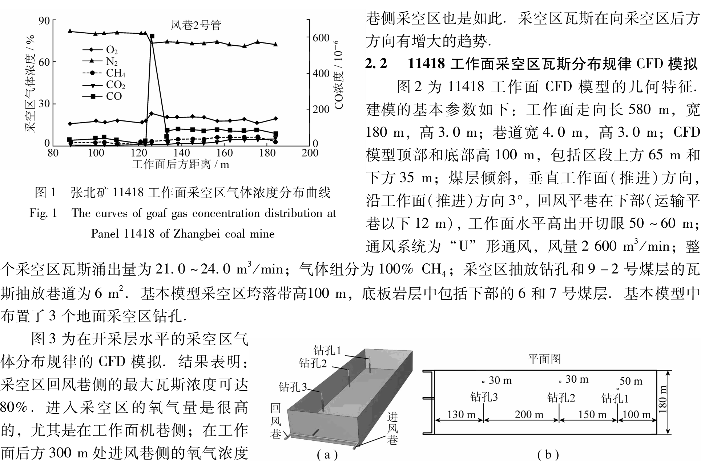
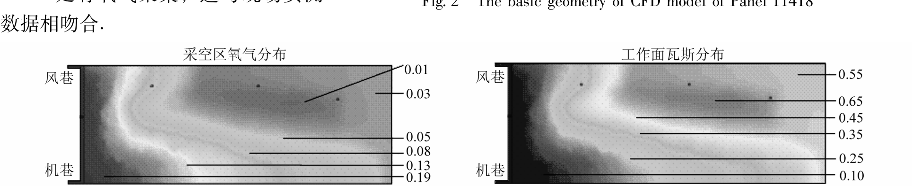
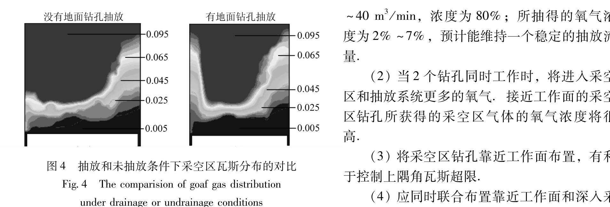
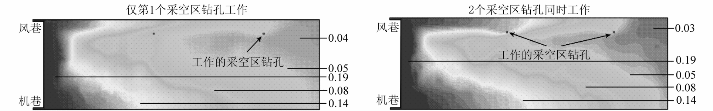

---
# 采空区瓦斯流动规律的 CFD 模拟

## 胡千庭1, 2, 3，梁运培2, 3，刘见中4
1. 中国矿业大学（北京）资源与安全工程学院，北京 100083；2. 山东科技大学 资源与环境工程学院，山东青岛 266510；3. 煤炭科学研究总院 重庆分院. 重庆 400037；4. 煤炭科学研究总院 科技发展部，北京 100013

### 摘 要：
采用 CFD 数值模拟方法对采空区瓦斯流动及分布规律进行了研究。阐明了计算流体力学 CFD 模拟的理论基础，介绍了运用 FLUENT 程序开发 CFD 模型的方法，并运用所开发的 CFD 模型对张北矿 11418 工作面采空区瓦斯流动规律以及地面钻孔抽放条件下瓦斯流动规律进行了模拟，模拟结果表明:采空区风巷侧的最大瓦斯浓度可达到80%。同时表明：采用 CFD 模型研究采空区瓦斯流动规律是可行的方法之一。

### 关键词：
采空区流动；瓦斯流动规律；CFD 模拟

### 中国分类号：
TD712.5

### 文献标识码：
A

---

# CFD simulation of goaf gas flow patterns

## HU Qian-ting1, 2, 3, LIANG Yun-pei2, 3, LIU Jian-zhong4
1. School of Resource and Safety Engineering，China University of Mining and Technology（Beijing）, Beijing 100083，China；2. College of Natural Resource and Environmental Engineering. Shandong University of Science and Technology, Qingdao 266510, China；3. Gas Department Chongqing Branch，China Coal Research Institute, Chongqing 400037, China；4. Dept. of Science and Technology, China Coal Research Institute，Beijing 100013，China 

### Abstract
Goaf gas flow and distribution patterns were studied by means of CFD numerical simulation. Discussed the theoretical basis of computational fluid dynamics (CFD) simulation, and introduced the CFD model development method based on FLUENT program. Goaf gas flow patterns, as well as gas flow rules by boreholes drainage, were simulated applying the developed CFD model at Panel 11418 of Zhangbei coal mine. The simulating results show that the maximum gas concentration can be 80% at the side of return airways. It suggests that studying goaf gas flow patterns applying CFD model is one of the feasible methods. 

### Key words
flow field in goaf; gas flow patterns; CFD simulation

掌握采空区瓦斯分布和流动规律，是研究工作面合理通风方式、防治自然发火以及瓦斯治理的关键的技术基础之一。为了研究采空区瓦斯流动规律，笔者在张北矿 11418 工作面采用井下监测系统测定采空区气体的分布，同时采用基本 CFD（计算流体力学）模型对采空区瓦斯流动规律进行了数值模拟。本文主要对运用 CFD 模型模拟采空区瓦斯运动及分布规律的方法和结果。

---

## 1  
采空区瓦斯流动及分布的 CFD 模拟方法

采空区瓦斯流动非常复杂，它受多种因素的影响，如通风、瓦斯密度、浮力，以及采空区透滤性。

---

收稿日期：2006-07-31

英雄编辑：毕永华

基金项目：国家重点基础研究发展计划（973）资助项目（2005CB221503）；国家自然科学基金重点资助项目（50534080）；山东省蓬莱学者计划学术带头人资助项目

通讯作者：胡千庭（1957-），男，江西吉安人，研究员，博士生导师。E-mail: huqitin@ccpri.com；联系人：梁运培。E-mail: liangyunpei@126.com

## 1.1 采空区瓦斯流动 CFD 模拟的理论基础

CFD 模拟研究是为了得到流体流动特性的数值解法。它通过对复杂得到所关注的整体流场的数值描述。CFD 的基础是建立 Navier-Stokes 方程，它是描述流体流动守恒定律的偏微分方程组的。为了模拟采空区煤层和气体在工作面方向的迁移，模拟必须解决三种仁的方程组，并对质量和动量的守恒方程进行求解。质量守恒方程称为连续性方程，可表示为

$$
\frac{\partial \rho}{\partial t} + \nabla \cdot (\rho \mathbf{v}) = S_m, \tag{1}
$$

式中，$\rho$ 为密度；$t$ 为时间；$\mathbf{v}$ 为速度；源 $S_m$ 为从分散优化生和相仿其它用户自定义的源流：连续性相上的质量量。

式 (1) 是质量守恒方程的常规形式，它对不可压缩流体和和压缩流体都适用。动量守恒方程在一个惯性坐标系（或加速度）内可表示为

$$
\frac{\partial}{\partial t} (\rho \mathbf{v}) + \nabla \cdot (\rho \mathbf{v v}) = \nabla \cdot \mathbf{P} + (\mathbf{\tau}) + \rho \mathbf{g} + \mathbf{F},
$$

其中，$P$ 为静压；$\tau$ 为动力粘度；$\rho g$ 和 $\mathbf{F}$ 分别为重力体力和外部体力。$\mathbf{F}$ 同样包含其它的附属于模型的源， 如多相介质和用户自定义源。

在研究中，采空区取查看作是一多孔介质，相对于标准的流体流动方程，附加了动量源进行模拟。此源由2部分组成：黏滞损失项（式(2)右首第1项）和惯性损失项（式(2)右首第2项）。

$$
S_i = \sum_{j=1}^{3} D_{ij} \mu v_i + \sum_{j=1}^{3} \frac{1}{2} c2 \rho |v_j| v_i, \tag{2}
$$

式中，$S_i$ 为第i个（$x,y,z$ 或者）动量方程的源；$u$ 为分子粘度；$D$ 和$C$ 为定义的矩阵；$ρm_w$ 为速度向量的模；ν 为在 $x,y,z$ 方向的速度分量。该动量的敏弱特有利于孔隙单元中压力梯度的产生，所引起的压力降与单元中的流动速度（或速度平方）成比例。

在多孔介质流中，多孔腺与速度成比例。忽略对流动速度和平散，可用 Darcy 定律简化多孔介质模型，即

$$
\nabla p = - \frac{\mu}{\alpha} \mathbf{v},
$$

式中，$\alpha$ 为渗透率。

在孔隙区域的力坐标轴（$x,y,z$）方向的压力降为

$$
\Delta p_x = \sum_{j=1}^{3} \frac{\mu}{\alpha_x} v_j, \quad \Delta p_y = \sum_{j=1}^{3} \frac{\mu}{\alpha_y} v_j, \quad \Delta p_z = \sum_{j=1}^{3} \frac{\mu}{\alpha_z} v_j,
$$

式中，$\alpha y$ 为沿$x$方向的项，$\alpha y$ 为孔隙区域在$x y z$方向的厚度。
采空区气体整体的主要来源：由于干涉度、热梯度造成的扩散方程散，以及由于压力梯度造成的黯性流或质量流。根据 Fick 定律，扩散的发生在孔内，即

$$
J_i = \rho D \frac{\partial}{\partial x_i} - \frac{D_{i}^{T} \partial T}{\partial x_i }, \tag{3}
$$

式中，$J_i$ 为第i种气体的扩散流量，它是由浓度梯度、热梯度引起的；$D_{\text{mix}}$ 为混和气体的扩散系数；$X_i$ 为气体的质配置数；$D$ 为热扩散系数；$T$ 为温度。

对于非常薄液体，式(3) 可用多组分的扩散公式代替，即

$$
J_i = \rho D \sum_{j=1}^{n} m_i S_{D_{i}} \left( \sum_{j=1}^{n} X_i \frac{\Delta X}{\Delta 1} \theta_{i} - \frac{\partial \sigma_{\text{mix}} }{m_{\text{min}} } \frac{\Delta V}{\Delta j} 
+ \frac{\mu_j}{X_i m_i} \frac{\partial m_{\text{mix}} }{\partial x_i} - \frac{D_{\text{mix}}^T}{X_i M_{\text{mix}}} \frac{\Delta m_{\text{mix}}}{\Delta j} \right)
$$

式中，$m_{\text{mix}}$为气体的分子量；$m_{\text{mix}}$为混合气体的分子量；$D_{\text{up}}$是气体中间组分的多组分扩散系数。

以上分析了建立采空区体流动模型的基本方程及其原理，在确定模型的边界条件后，可以运用数值方法对模型进行求解。

解法决共解矿解，即可得到采空区瓦斯流动及分布规律。

## 1.2 采空区瓦斯运移CFD模型开发

基于上述原理，采用商业的CFD程序FLUENT来模拟采空区气体的流动规律。FLUENT是通过有限体积分法为学计算，采用Navier-Stokes方程。为了得到采空区瓦斯流动规律的典型情况，将二维CFD模型划分大约50000个单元网格。CFD模型是通过FLUENT的Gambit前处理进行构建和划分网格的，随后导入解算器进行模拟。三维的FLUENT模型可包含四面体、六面体、棱锥体、锥形单元或它们的组合。本次开发的CFD模型的一个创新点，是通过一系列与求解器直接的用户自定义函数，将采空区渗透率分布和瓦斯涌出相结合。这些用户自定义函数采用C语言编写，被解算器编辑后调用从而形成与FLUENT的紧密挂接。
煤岩层的渗透率是控制工作面瓦斯涌出的主要因素。由于采引起的应力分布对采层和邻近层的渗透率都有影响，从而就决定了瓦斯涌出规律。渗透率的递减量取决于工作面前方地层的裂隙发育程度，以及工作面后方的应力释放速度、不同的煤层，由于其采层裂隙和孔隙率的不同，其渗透率的变化也不同。通过对采空区应力场做初步的规划和分析及以前CFD模型研究结果的对比，确定了采空区的渗透率分布，不同区域的渗透率变化为 $10^{-4} \sim 10^{-9} m^2$. 采空区最大黏性渗透率约为 $10^{-7} m^2$。
采空区故群作多孔块，作用U端写的外部子程序村在此区域内的孔隙率和采空区气体（作为一个质量源）的连续分布插值未知变量。定义“逼迫多个质量流”的基本子程序模块。这里子程序模块，与FLUFT体通过多孔的采空区的动， 是通过在动界播一插入一个动边杆模块提出的，该水楔的黏性端分寸插成ikali记电，面谨性外量与气体的动能成中提。通过该子程序来尺风可的涌风和采空区瓦斯涌出情况，这些子程序随动教组合到CFD程序以进行模拟。
对于此研究，由于所给定的关底⊕气场（气为动（←为端分布风压c有明分为刚石牛气流导一度大、高数，且具有合理的控制，因此用它来模拟气体在采空区的运动。该模型总体包括两个个公式，这两个相三个的传送公式的求解，允许流速速度和长度的比例各自独立确定。用该模型可模拟瓦工仿面前的流流动和采空区局高的瓦斯流动。

## 1.3 采空区瓦斯运移规律的CFD模拟的方法

采空区内的气体流动现具有复杂的，它涉及多种因素，如通风、气体密度、浮力和采空区渗透性。综合考虑这些因素，并结合试立即工作面的具体情况，建立了CFD模型，并通过模型建立了基本的采空区分布形态。模型应用了现场收集的数据，以及以往在采空区瓦斯流动CFD建模的经验。
CFD模型的建立主要包括下以下工作：
（1）现场收集工作面采空区的几何形状和其它参数，如瓦斯流量和采空区瓦特等；
（2）具有采空区、走势和坡放破孔等的长壁工作面的三维有限元流观模型的构建。
（3）利用用户自定义程序进行流动求解和边界条件。
（4）工作面基本情况规模型的模拟。
（5）用现场测得的采空区瓦斯流压测和抽放数据对基本模型进行校准和验证。
⑹利用传后的CFD模块进行一定的参数研究和模型的优化。
工作的原因是特点、地质条件、瓦斯测通观数据进行依拢与校实，并对其可用性进行分透并用这些信息，建立一维、二维的CFD模型，以模拟采空区瓦斯的流动特征。

## 2 张北矿11418工作面采空区瓦斯分布规律的CFD模拟

### 2.1 11418工作面采空区瓦斯浓度监测

为了现场验证采空区瓦斯分布规律，采用远近的方法布置瓦斯气体监测方案，并布置了采空区管道采 监测，守采空区瓦体浓度进行监测。图1为11418工作面从切眼推过350m后， 工作面后方及时的采空区管道监测点的详井分析结果。该结果表明，橡人采空区气兽量是高的，即便在工作面后方 100m 的时。

图 1  张北矿11418工作面采空区气体浓度分布曲线
###### Fig. 1  The curves of goaf gas concentration distribution at Panel 11418 of Zhangbei coal mine

图 2  11418工作面基本的CFD模型几何特征
###### Fig. 2  The basic geometry of CFD model of Panel 11418

图 3  11418工作面采空区气体分布的CFD模拟
###### Fig. 3  Goaf gas distribution in the CFD model of Panel 11418

图 4 抽放和未抽放条件下采空区瓦斯分布的对比  
Fig. 4 The comparison of goaf gas distribution under drainage or undrainage conditions

图 5 1418 工作面不同钻孔组合情况下采空区的氧气分布  
Fig. 5 Oxygen distribution in the goaf of Panel 1418 with different boreholes combinations
