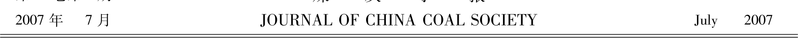
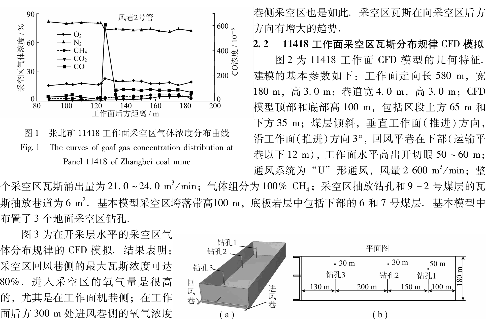
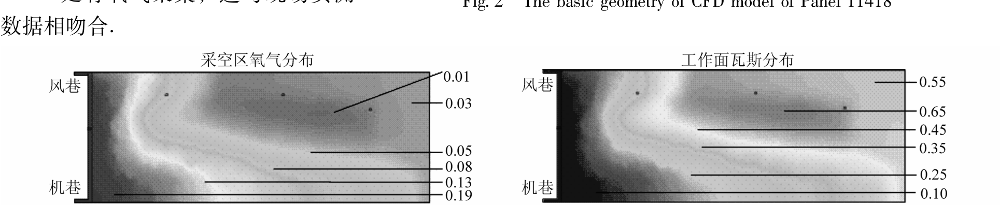

# 煤矿学 报

## VOL. 32 No. 7 JULY 2007

### 0_0.png

---

## 采空区瓦斯流动规律的CFD模拟

**文章编号**: 0253-9993(2007)07-0719-05

#### 摘要：
采用CFD数值模拟方法对采空区瓦斯流动及分布规律进行了研究。阐明了计算流体动力学(CFD)模拟的理论基础，介绍了运用FLUENT程序开发CFD模型的方法，并运用所开发的CFD模型对张北矿11418工作面采空区瓦斯流动规律以及地面钻孔抽放条件下瓦斯流动规律进行了模拟，模拟结果表明：采空区瓦斯流动规律是可行的方法之一。

#### 关键词：
采空区流动；瓦斯流动规律；CFD模拟
中图分类号：TD712.5 文献标识码：A

---

## CFD simulation of goaf gas flow patterns

#### HU Qian-ting, 1,2,3, LIANG Yun-pei, 2,3, LIU Jian-zhong 4

##### Abstract:
Goaf gas flow and distribution patterns were studied by means of CFD numerical simulation. Discussed the theoretical basis of computational fluid dynamics (CFD) simulation, and introduced the CFD model development method based on FLUENT program. Goaf gas flow patterns, as well as gas flow rules by boreholes drainage, were simulated applying the developed CFD model at Panel 11418 of Zhangbei coal mine. The simulating results show that the maximum gas concentration can be 80% at the side of return airways. It suggests that studying goaf gas flow patterns applying CFD model is one of the feasible methods.

##### Key words:
flow field in goaf; gas flow patterns; CFD simulation

### 1 采空区瓦斯流动及分布的CFD模拟方法
#### 采空区瓦斯流动非常复杂，它受多种因素的影响，如通风，瓦斯密度，浮力，以及采空区渗透性。进

煤 炭 学 报

中国煤炭行业知识服务平台 www.chinacaj.net

2007年第32卷

720

1.1 采空区瓦斯流动CFD数值模拟的理论基础

CFD数值模拟是为了得到流体流动控制方程的数值解法,它通过时空求解得到所关注的整体流场的数学描述1,5).CFD的基础是建立Navier-Stokes方程,它是由一系列描述流体流动守恒定律的偏微分方程组成的.为了模拟采空区混合气体在工作面后的运动,模型必须像一种气体的守恒方程那样,对质量

和动量的守恒方程进行求解.质量守恒方程或称为连续性方程,可表示为

$$\frac{\partial \rho}{\partial t} +\nabla \cdot (\rho \mathbf{v}) = \rho \mathbf{S}_m,$$

式中, $\rho$为密度;$t$为时间;$v$为速度; $S_m$为从分散源生和任何其它用户自定义的源加在连续相上的质量。

式(1)是质量守恒方程的常规形式,它对不可压缩流体和压缩流体都适用,动量守恒方程在一个惯性参照系(没提速度)内可表示为

$$\frac{\partial}{\partial t} (\rho \mathbf{v}) +\nabla \cdot (\rho \mathbf{v} \mathbf{v}) = -\rho \nabla \psi + \nabla \cdot (\psi \mathbf{P}) + \mathbf{F},$$

其中，$p$为静压力；$\tau$为应力张量；$p_g$和$F$分别为重力体力和外部体力。$F$同样包含其它的属于模型的源,如多相介质和用户自定义源。

在研究中,采空区被看作是多孔介质,相对于标准的流体流动方程,附加了动量源进行模拟。此源由2部分组成:

（1）黏滞损失项 (式 (2) 右首第1项)和惯性损失项 (式 (2) 右首第2项).

$$S_i = \sum_{i=1}^3 \sum_{j=1}^{j=1} \left[D_{\mu\nu} \frac{\partial u_\nu}{\partial x_\mu} + \sum_{j=1}^{j=1} C_{\mu} \frac{\partial p_{mag}}{\partial x_\mu} u_\nu\right],$$

式中，$S_i$为第$i$个$(x,y$或$z)$动量方程的源；$\mu$为分子黏度；$D$和$C$为预定义的矩阵；$v_{mag}$为速度向量；$v$为在$x$,$y$和$z$方向的速度分量,该动量的减弱将有利于孔隙单元中压力梯度的产生,所引起的压力降与单元中的流动速度(或速度平方)成比例。

在多孔介质层流中,压力降一般与速度成比例。忽略对流加速度和扩散,可用Darcy定律简化多孔质模型,即

$$\nabla p = \frac{\nabla \psi}{\alpha},$$

式中，$\alpha$为渗透率。

在孔隙区域3个坐标轴$(x,y,z)$方向的压降为

$$\Delta p_x = \sum_{j=1}^3\left[ \sum_{i=1}^3 \alpha_{ij} S_{v_i} \Delta n_i,\quad \Delta p_y = \sum_{i=1}^3\left[\sum_{i=1}^3 \alpha_{ij} S_{v_i} \Delta n_i,\quad \Delta p_z = \sum_{i=1}^3\left[\sum_{i=1}^3 \alpha_{ij} S_{v_i} \Delta n_i,\right.\right.\right.$$

式中，$1/\alpha_{ij}$为矩阵$D$中的项；$\Delta n_i$,$\Delta n_{ix}$和$\Delta n_{iz}$为孔隙区域在$x$，$y$和$z$方向的厚度。

采空区气体运动的主要控因素有：由于浓度、热梯度造成的分子扩散，以及由于压力梯度造成的黏性流或质量流。根据Fick定律，扩散的发生如下，即

$$J_i = \nabla p_D \frac{\partial X}{\partial T} \alpha \frac{\partial T}{\partial x_i},$$

式中，$J_i$为第$i$种气体的扩散流速,它是由浓度梯度、温度梯度引起的；$D_m$为混合气体的扩散系数；$X$为气体$i$的质量分数；$D_i$为热扩散系数；$T$为温度。

对于非薄气体,式(3)可用多组分的扩散公式代替,即

$$J_i = p_M \frac{D_M}{\partial \mu_{mix}} \sum_{j=1}^{j=1} \frac{D_M}{D_{mix}} \frac{\partial p_{mix}}{\partial x_j} - \frac{\partial p_{mix}}{\partial x_j},$$

式中，$M$为气体$i$的分子量；$M_{mix}$为混合气体的分子量；$D_{mix}$是气体$i$中气体组分$i$的多组分扩散系数。

以上分析了建立采空区气体流动模型的基本方程及其原理,在确定模型的边界条件后,可以运用数值

中国煤炭行业知识服务平台| [www.chinacaj.net](http://www.chinacaj.net)

第7期

胡千庭等：采空区瓦斯流动规律的CFD模拟

解法求其解析解，即可得到采空区瓦斯流动及分布规律。

1.2 采空区瓦斯运动模拟CFD模型开发

基于上述原理，采用商业的CFD程序FLUENT来模拟采空区气体的流动规律。FLUENT是通过有限积的流体动力学计算，来求解Navier-Stokes方程，为了得到采空区瓦斯流动规律的典型情况，将三维CFD模型划分为500000个单元格。CFD模型是通过FLUENT的Gambit前处理器进行构建和划分网络的组合。本次开发的CFD模型的一个创新点，是通过一系列与求解器连接的用户自定义函数，将采空区渗透率分布和瓦斯涌出相结合。这些用户自定义函数采用C语言编写，被解释和编译后用户图形界面与FLUENT的求解器连接。

煤层层的渗透率是控制工作面瓦斯涌出的主要因素。由于开采引起的应力分布对开采层和邻近层的渗透率都有影响，从而决定了瓦斯涌出规律。渗透率逐渐减小取决于工作面前方地层的裂隙发育程度，以及工作面后方的应力释放程度。不同的岩石，由于其开采强度和孔隙率的不同，其渗透率的变化也不同。通过对称采空区应力载荷分布规律的分析和以前CFD模拟研究的经验，确定了采空区的渗透率分布，不同区域的渗透率变化为10−6~10−9 m2。采空区最大黏性渗透率约为10−10 m2。

采空区被认为是众多块体，并已用编写的外部程序对在此区域内的孔隙率和采空区气体（作为一个质量源）的连续分布进行定义。这些“源”随后被加入“通过多孔介质流动”的基本方程模块。在这些方程模块中，混合气体通过多孔的采空区的流动，是通过在动量方程上添加一个动量水槽来模拟的，该水槽的黏性部分与黏度成正比，而惯性分量与气体的动能成正比。通过该方程程序反馈不同的通风和采空区瓦斯涌出情况，这些子程序随后被组合到CFD主程序中进行模拟。

对于此研究，由于标准的k−e方程（k为湍动能，e为耗散率）模拟大范围湍流流动的功能更加强大、高效，且具有合理的精度，因此用它来模拟气体在采空区的湍流。这种最简单的湍流“全模型”包括2个公式，这两个相互独立的传递方程的求解，允许湍流速度和长度的比例各自独立确定。用该模型可模拟近工作面的湍流流动和采空区内部的层流流动。

1.3 采空区瓦斯运动规律CFD模拟的方法

采空区内的气体流动规律是复杂的，它涉及多种因素，如通风、气体密度、浮力和采空区渗透性。综合考虑这些因素，并结合试验工作面的具体情况，建立了CFD模型，并通过模拟建立了基本的采空区分形。模型应用了现场收集的数据，以及以往采空区瓦斯流动CFD建模的经验。

CFD模型的建立主要包括以下工作：

（1）现场收集工作面采空区的几何形状和其它参数，如瓦斯流量和采空区垮落特征等。

（2）具有采空区、巷道和抽放钻孔等的长壁工作面的三维有限元模型的构建。

（3）通过用户自定义方程程序设置流动模型和边界条件。

（4）工作面基本情况模型的模拟。

（5）用现场测量的采空区瓦斯监测和抽放数据对基本模型进行校准和验证。

（6）利用校正后的CFD模型进行广泛的参数研究和模型的优化。

对工作面的基本信息、地质资料、瓦斯、通风监测数据进行收集与核实，并对其进行可用性进行分析。利用这些信息，建立一组三维的CFD模型，以模拟采空区瓦斯的分布特征。

2 张北矿11418工作面采空区瓦斯分布规律的CFD模拟

2.1 11418工作面采空区瓦斯浓度监测

为了现场测定采空区瓦斯分布规律，采用改进的采空区气体监测方案，并布置了束管监测系统。对采空区气体浓度进行了监测。图1为11418工作面从开眼推过350m后，工作面后方风巷侧的采空区束管监测点的气样分析结果。该结果表明，渗透采空区的氧气含量是非常高的，即便在工作面后方100m的风

# Fig. 1:
The curves of goaf gas concentration distribution at Panel 11148 of Zhangbei coal mine

# Fig. 3:
Goaf gas distribution in the CFD model of Panel 11148

### 第 7 期

#### 胡千平等：采空区瓦斯流动规律的 CFD 模拟

##### 4.0.png
图 4 抽放和未抽放条件下采空区瓦斯分布的对比  
Fig. 4 The comparison of gas distribution under drainage or undrained conditions

##### 4.1.png
图 5 141 118 工作面不同孔组合情况下采空区的氧分布  
Fig. 5 Oxygen distribution in the coal seam of Panl 141 118 with different boreholes combinations

### 4 结论

（1）现场实测瓦斯分布规律难度大、工程量大，且效果不理想。经对比研究，采用 CFD 模型模拟得到的采空区瓦斯流动规律与现场实测结果相吻合。因此，采用 CFD 模型研究采空区瓦斯流动规律是可行的方法之一。

（2）CFD 模拟结果表明，采空区回风巷侧的最大瓦斯浓度可达 80%，同时，进入采空区的氧气量很高，尤其是在工作面巷侧。

（3）采用 CFD 模型模拟了地面钻孔抽放条件下瓦斯流动规律，可为地面采空区的瓦斯抽放钻孔设计提供依据。

##### 参考文献:
[1] 梁运培，孙东玲．岩层移动的组合岩理论及其应用研究[J]．岩石力学与工程学报，2002，21（5）：654～657．
[2] 许家林，孟广石．应用上覆岩层采动裂隙“O”形圈特征抽放采空区瓦斯[J]．煤矿安全，1995（7）：2～4．
[3] 梁栋，周西华．回采工作面瓦斯运动规律的数值模拟[J]．辽宁工程技术大学学报，1999，18（4）：337～341．
[4] 王福军．计算流体动力学分析[M]．北京：清华大学出版社，2004．
[5] 傅德燕，马延文．计算流体力学[M]．北京：高等教育出版社，2004．
[6] 淮南矿业（集团）有限责任公司，煤炭科学研究总院重庆分院，澳大利亚联邦工业科学院．地面钻井抽放采动区域瓦斯技术研究[R]．重庆：2006．

