ICS 07.040  
CCS A 79

# 中华人民共和国国家标准

GB/T 13989—202×  
代替GB/T 13989—2012

---

## 全球基本比例尺地图分幅和编号

### Subdivision and numbering

### for the global primary scale maps

（征求意见稿）

202×-××-××发布  
202×-××-××实施

国家市场监督管理总局 发布  
国家标准化管理委员会 委员会

# 前言

本文件按照 GB/T 1.1—2020《标准化工作导则 第1部分：标准化文件的结构和起草规则》的规定起草。

本文件代替 GB/T 13989—2012《国家基本比例尺地形图分幅和编号》。与 GB/T 13989—2012 相比，除编辑性修改外，主要技术变化如下：

- 标准名称由“国家基本比例尺地形图分幅和编号”修改为“全球基本比例尺地形图分幅和编号”（见封面）；
- 扩大了标准范围，将标准范围由“国家基本比例尺地形图的分幅和编号”扩大为“全球基本比例尺地形图的分幅和编号”（见第1章）；
- 按照 GB/T 1.1—2020 要求，增加了“规范性引用文件”（见第2章）；
- 增加了术语“分幅”、“图幅编号”、“南、北极”及其定义（见第3章）；
- 在“全球基本比例尺地形图分幅（南、北极除外）”中，增加了 1:1 000 000~1:500 基本比例尺地图经度 60°~76° 和纬度 76°~88°之间的经纬度分幅覆盖率（见第4章）；
- 在“基本比例尺地图幅编号（南、北极除外）”中，增加了“经纬度分幅图幅编号结构”，并增加“南、北半球代码”；将 1:500 000=1:500 基本比例尺地图经纬度分幅图幅行、列编号方法修改为横向从上到下（亦称从北到南），纵列从左到右（亦称从西到东）；将 1:500 000=1:500 基本比例尺地图经纬度分幅图幅前行、列数字编号位数进行了统一，图幅行号、列号均采用四位数字编号表示（见 5.2）；
- 增加了“南、北极基本比例尺地图分幅”（见第6章）；
- 增加了“南、北极基本比例尺地图图幅编号”（见第7章）；
- 补充了 1:500 000=1:500 基本比例尺地图（南、北极除外）经纬度分幅图幅编号的示例（见附录 A）；
- 修改了基本比例尺地图（南、北极除外）经纬度分幅图幅编号图幅编号和图幅经、纬度计算公式，并补充了相关示例；
- 增加了“南、北极基本比例尺地图经纬度分幅图幅编号示例”（见附录 C）；
- 增加了“南、北极 1:500 000=1:500 基本比例尺地图经纬度分幅图幅编号和图幅经、纬度计算”（见附录 D）。

请注意本文件的某些内容可能涉及专利。本文件的发布机构不承担识别专利的责任。

本文件由全国地理信息标准化技术委员会（SAC/TC 230）归口。

GB/T 13989—202X

本文件起草单位：自然资源部测绘标准化研究所、自然资源部第一航测遥感院。

本文件主要起草人：舒琦。

本文件代替标准的历次版本发布情况为：

——GB/T 13989—1992；

——GB/T 13989—2012。

# 全球基本比例尺地图分幅和编号

## 1 范围

本文件规定了全球基本比例尺地图的分幅和编号，并给出了全球基本比例尺地图幅号的示例以及各比例尺地图幅编号图幅经、纬度计算应用的公式及其示例。  
本文件适用于全球1:1 000 000～1:500基本比例尺地图的分幅和编号。

## 2 规范性引用文件

本文件无规范性引用文件。

## 3 术语和定义

下列术语和定义适用于本文件。

### 3.1 分幅 subdivision

按照一定的规则划分地图幅的过程。

### 3.2 图幅编号 map sheets number

按照一定的规则对经过分幅的地图进行代码编制的过程或结果。

### 3.3 南、北极 north and south poles

南极极点至南纬88°和北极极点至北纬88°的区域。

## 4 基本比例尺地图分幅（南、北极除外）

### 4.1 1:1 000 000 基本比例尺地图分幅

1:1 000 000基本比例尺地图的分幅与国际1:1 000 000地图分幅保持一致。  
从赤道起，每纬差6°为一行，至南、北纬88°各分为22行；从180°经线起算，自西向东经度0°～60°之间每经差6°为一列，纬度60°～76°之间每经差12°为一列，纬度76°～88°之间每经差24°为一列，全球分为60列，30列，15列，由经线和纬线所围成的每一个梯形分幅（见图1，图2）为1:1 000 000地形图。  
北半球、南半球1:1 000 000基本比例尺地图的分幅示例分别见图1，图2。

GB/T 13989—201X

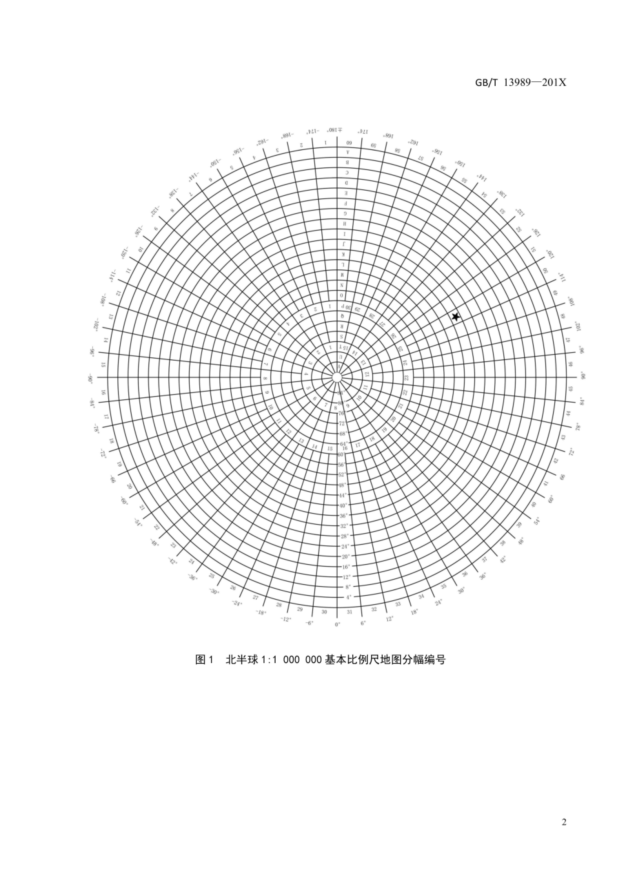

图1 北半球1:1 000 000基本比例尺地图分幅编号

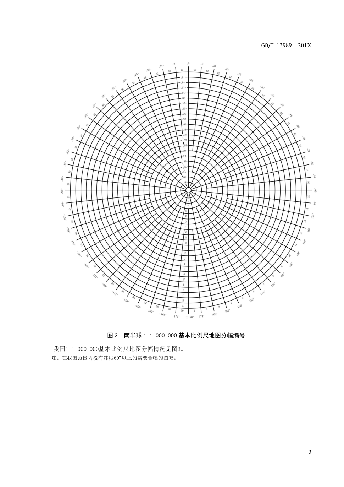

图2 南半球1:1 000 000 基本比例尺地图分幅编号

我国1:1 000 000基本比例尺地图分幅情况见图3。

注：在我国范围内没有纬度60°以上的需要分幅的图幅。

GB/T 13989—201X

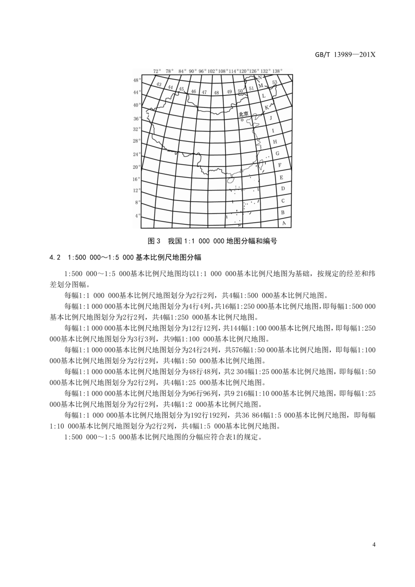

图 3 我国1:1 000 000地图分幅和编号

### 4.2 1:500 000～1:5 000 基本比例尺地图分幅

1:500 000～1:5 000基本比例尺地图均以1:1 000 000基本比例尺地图为基础，按规定的经差和纬差划分图幅。

每幅1:1 000 000基本比例尺地图均分为2行2列，共4幅1:500 000基本比例尺地图。

每幅1:1 000 000基本比例尺地图均分为4行4列，共16幅1:250 000基本比例尺地图。即每幅1:500 000基本比例尺地图均分为2行2列，共4幅1:250 000基本比例尺地图。

每幅1:1 000 000基本比例尺地图均分为12行12列，共144幅1:100 000基本比例尺地图。即每幅1:250 000基本比例尺地图均分为3行3列，共9幅1:100 000基本比例尺地图。

每幅1:1 000 000基本比例尺地图均分为24行24列，共576幅1:50 000基本比例尺地图。即每幅1:100 000基本比例尺地图均分为2行2列，共4幅1:50 000基本比例尺地图。

每幅1:1 000 000基本比例尺地图均分为48行48列，共2 304幅1:25 000基本比例尺地图。即每幅1:50 000基本比例尺地图均分为2行2列，共4幅1:25 000基本比例尺地图。

每幅1:1 000 000基本比例尺地图均分为96行96列，共9 216幅1:10 000基本比例尺地图。即每幅1:25 000基本比例尺地图均分为2行2列，共4幅1:10 000基本比例尺地图。

每幅1:1 000 000基本比例尺地图均分为192行192列，共36 864幅1:5 000基本比例尺地图。即每幅1:10 000基本比例尺地图均分为2行2列，共4幅1:5 000基本比例尺地图。

1:500 000～1:5 000基本比例尺地图的分幅应符合表1的规定。

# 表 1 1:1 000 000～1:500基本比例尺地图（南、北极除外）分幅

| 比例尺 | 1:1 000 000 | 1:500 000 | 1:250 000 | 1:100 000 | 1:50 000 | 1:25 000 | 1:10 000 | 1:5 000 |
|--------|-------------|-----------|-----------|-----------|----------|----------|----------|---------|
| 图幅范围 | 经线60'～60' | 6' | 3' | 1°30' | 30' | 15' | 7'30" | 3'45" | 1'52.5" |
|         | 经线60'～76' | 12' | 6' | 1° | 30' | 15' | 7'30" | 3'45" | 1'52.5" |
|         | 纬线60'～88' | 24' | 12' | 6' | 2° | 1° | 30' | 15' | 7'30" |
|         | 纬线 | 4° | 2° | 1° | 20' | 10' | 5' | 2'30" | 1'15" |
| 行列数量 | 行数 | 1 | 2 | 4 | 12 | 24 | 48 | 96 | 192 |
|         | 列数 | 1 | 2 | 4 | 12 | 24 | 48 | 96 | 192 |
|         | 1 | 4 (2×2) | 16 (4×4) | 144 (12×12) | 576 (24×24) | 2 304 (48×48) | 9 216 (96×96) | 36 864 (192×192) |
|         | 1 | 4 (2×2) | 36 (6×6) | 144 (12×12) | 576 (24×24) | 2 304 (48×48) | 9 216 (96×96) | 331 776 (288×288) |
|         | 1 | 9 (3×3) | 36 (6×6) | 144 (12×12) | 576 (24×24) | 2 304 (48×48) | 331 776 (288×288) | 1 327 104 (1 152×1 152) |
|         | 1 | 16 (4×4) | 64 (8×8) | 256 (16×16) | 2 304 (48×48) | 9 216 (96×96) | 36 864 (192×192) | 1 327 104 (1 152×1 152) |
| 图幅数量关系 | 1 | 4 (2×2) | 16 (4×4) | 64 (8×8) | 256 (16×16) | 2 304 (48×48) | 9 216 (96×96) | 36 864 (192×192) |
|         | 1 | 4 (2×2) | 16 (4×4) | 64 (8×8) | 256 (16×16) | 2 304 (48×48) | 9 216 (96×96) | 36 864 (192×192) |
|         | 1 | 4 (2×2) | 16 (4×4) | 64 (8×8) | 256 (16×16) | 2 304 (48×48) | 9 216 (96×96) | 36 864 (192×192) |
|         | 1 | 4 (2×2) | 16 (4×4) | 64 (8×8) | 256 (16×16) | 2 304 (48×48) | 9 216 (96×96) | 36 864 (192×192) |
|         | 1 | 4 (2×2) | 16 (4×4) | 64 (8×8) | 256 (16×16) | 2 304 (48×48) | 9 216 (96×96) | 36 864 (192×192) |
|         | 1 | 4 (2×2) | 16 (4×4) | 64 (8×8) | 256 (16×16) | 2 304 (48×48) | 9 216 (96×96) | 36 864 (192×192) |
|         | 1 | 4 (2×2) | 16 (4×4) | 64 (8×8) | 256 (16×16) | 2 304 (48×48) | 9 216 (96×96) | 36 864 (192×192) |
|         | 1 | 4 (2×2) | 16 (4×4) | 64 (8×8) | 256 (16×16) | 2 304 (48×48) | 9 216 (96×96) | 36 864 (192×192) |
|         | 1 | 4 (2×2) | 16 (4×4) | 64 (8×8) | 256 (16×16) | 2 304 (48×48) | 9 216 (96×96) | 36 864 (192×192) |

GB/T 13989—201X

4.3 1:2 000、1:1 000、1:500基本比例尺地图分幅

#### 4.3.1 经纬度分幅

1:2 000、1:1 000、1:500地形图宜以1:1 000地形图为基础，按规定的经差和纬差划分图幅。  
每幅1:1 000地形图划分为576行576列，共331 776幅1:2 000地形图，即每幅1:2 000地形图划分为3行3列，共9幅1:2 000地形图。  
每幅1:1 000地形图划分为1 152行1 152列，共1 327 104幅1:1 000地形图，即每幅1:2 000地形图划分为2行2列，共4幅1:1 000地形图。  
每幅1:1 000地形图划分为2 304行2 304列，共5 308 416幅1:500地形图，即每幅1:1 000地形图划分为2行2列，共4幅1:500地形图。  
1:2 000、1:1 000、1:500地形图经纬度分幅应符合表1的规定。

#### 4.3.2 矩形分幅

1:2 000、1:1 000、1:500基本比例尺地图可根据需要采用50cm×50cm或40cm×50cm矩形分幅。

### 5 基本比例尺地图图幅编号（南、北极除外）

#### 5.1 1:1 000 000基本比例尺地图的图幅编号

1:1 000 000基本比例尺地图的编号与国际1:1 000 000地图编号保持一致。  
1:1 000 000基本比例尺地图的图幅编号，由该图所在的南北半球代码、行号和列号组成。  
a) 南北半球代码：用“N”表示北半球，用“S”表示南半球。当图幅位于北半球时，亦可省略字母“N”。  
b) 行号：从赤道起算，每纬差4°为1行，至南、北纬88°各分为22行，依次用大写拉丁字母（字母A、B、C、……、V）表示（见图1、图2）。  
c) 列号：从180°经线起算，向西向东经度0°～60°之间每经差6°（经度60°～76°之间每经差12°、经度76°～88°之间每经差24°）为1列，全球分为60列（30列、15列），依次用阿拉伯拉伯数字（数字1、01、02、03、……、60表示（见图1、图2）。  

注1：我国图幅合并在赤道以上。我国范围内1:1 000 000基本比例尺地图的编号省略南北半球表示和北半球的字母代码N，见图3。  
注2：为了便于基本比例尺地图图幅编号和图幅经纬度的统计，西半球的经度、南半球的纬度均以负数表示，例如，西半球西经60°记作-60°，南半球南纬40°记作-40°。见图1、图2。  

示例：  
图1中标注“★”位置所在的1:1 000 000基本比例尺地图的图幅编号（南极除外）为150，为与图幅所在的1:1 000 000基本比例尺地图图幅行号（字母符号）、列号编号所指的1:1 000 000基本比例尺图幅列号（数字符号）（见图1），省略了用来表示北半球的字母“N”。

#### 5.2 1:500 000:1:500基本比例尺地图经纬度分幅图幅编号

##### 5.2.1 经纬度分幅图幅编号结构

1:500 000:1:500基本比例尺地图的经纬度分幅图幅编号由南北半球代码、1:1 000 000基本比例尺地图图幅行号、比例尺代码和图幅行号、列号组成，见图4。

GB/T 13989—201X

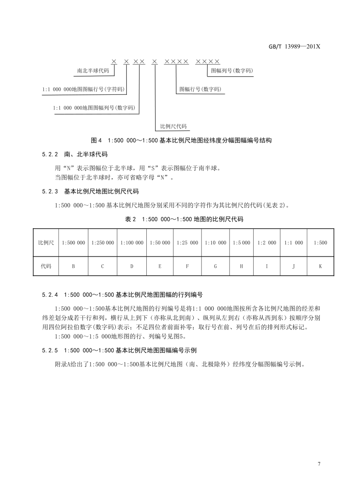

图 4 1:500 000~1:1 500 000基本比例尺地图经纬度分幅图幅编号结构

5.2.2 南、北半球代码

用“N”表示图幅位于北半球，用“S”表示图幅位于南半球。
当图幅位于北半球时,亦可省略字母“N”。

5.2.3 基本比例尺地图比例代码

1:500 000~1:1 500 000基本比例尺地图分别采用不同的字母作为其他比例尺的代码（见表2）。

表 2 1:500 000~1:1 500 000地图的比例尺代码

| 比例尺  | 1:500 000 | 1:250 000 | 1:100 000 | 1:50 000 | 1:25 000 | 1:10 000 | 1:5 000 | 1:2 000 | 1:1 000 | 1:500 |
| ------- | --------- | --------- | --------- | -------- | -------- | -------- | ------- | ------- | ------- | ----- |
| 代码    |     B     |     C     |     D     |    E     |    F     |    G     |    H    |    I    |    J    |   K   |

5.2.4 1:500 000~1:500 基本比例尺地图图幅的行列编号

1:500 000~1:1 500 000基本比例尺地图的行列编号是将1:1 000 000地图按所有各比例尺地图的经差和纬差划分成若干行和列，横行从上到下（亦称从北到南），纵列从左到右（亦称从西到东）；按顺序分别用四位阿拉伯数字（数字码）表示；不足四位者前面补零。取行号在前，列号在后的排列形式标记。
1:500 000~1:5 000地图的行、列号见图6。

5.2.5 1:500 000~1:500 基本比例尺地图图幅编号示例

附录给出了1:500 000~1:500基本比例尺地图（南、北极除外）经纬度分幅图幅编号示例。

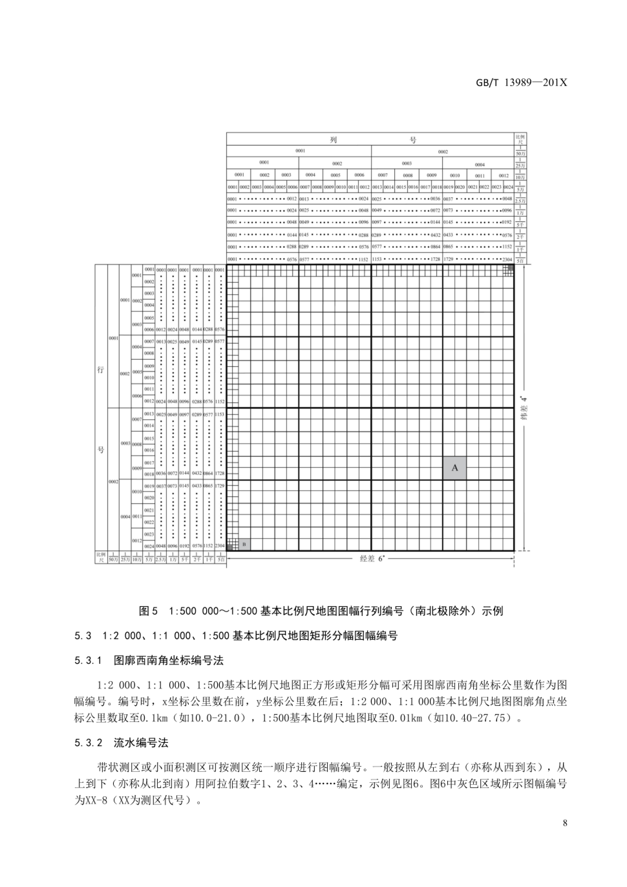

图 5 1:500 000~1:500 基本比例尺地图幅行列编号（南北极除外）示例

5.3 1:2 000, 1:1 000, 1:500 基本比例尺地图矩形分幅图幅编号

5.3.1 图幅西南角坐标编号法

1:2 000, 1:1 000, 1:500 基本比例尺地图正方形或矩形分幅可采用图幅西南角坐标为图幅编号。编号时，X坐标公里数在前，y坐标公里数在后；1:2 000, 1:1 000基本比例尺地图矩形角点坐标公里数取至0.1km（如10.0~21.0），1:500基本比例尺地图取至0.01km（如10.40~27.75）。

5.3.2 流水编号法

带状图区或小面积测区可按测区统一顺序进行图幅编号，一般按从左到右（亦称从西到东），从上到下（亦称从北到南）用阿拉伯数字1, 2, 3, 4……编号，示例如图6。图6中灰色区域所示图幅编号为XX-8（XX为测区代码）。

GB/T 13989—201X

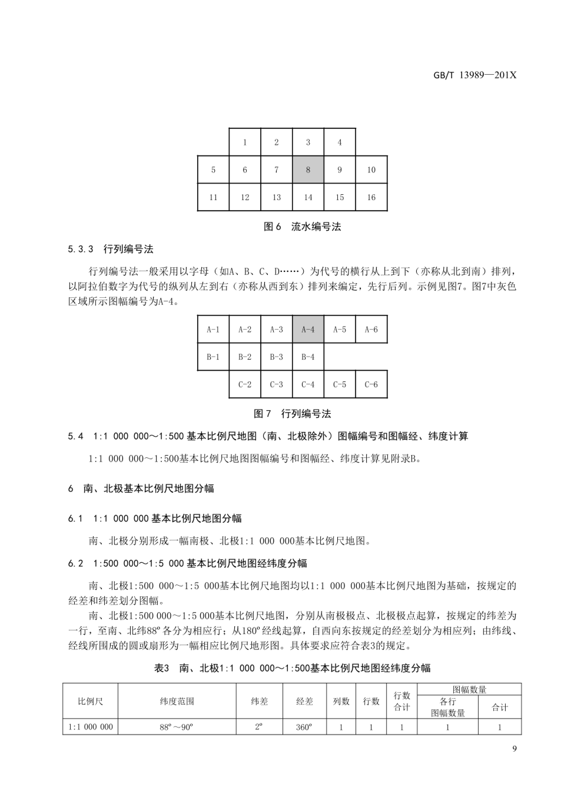

图 6 流水编号法

5.3.3 行列编号法

行列编号法一般采用以字母（如A、B、C、D⋯⋯）为代号的横行从上到下（亦称从北到南）排列，以阿拉伯数字为代号的纵列从左到右（亦称从西到东）排列来确定。先行后列。示例见图7。图中灰色区域所示图幅编号为A-4。

图 7 行列编号法

5.4 1:1 000 000～1:500 基本比例尺地图（南、北极除外）图幅编号和图幅经、纬度计算

1:1 000 000～1:500基本比例尺地图图幅编号和图幅经、纬度计算见附录B。

6 南、北极基本比例尺地图分幅

6.1 1:1 000 000 基本比例尺地图分幅

南、北极分别形成一幅南极、北极1:1 000 000基本比例尺地图。

6.2 1:500 000～1:5 000 基本比例尺地图经纬度分幅

南、北极1:500 000～1:5 000基本比例尺地图均以1:1 000 000基本比例尺地图为基础，按规定的经差纬差分别分图幅。

南、北极1:500 000～1:5 000基本比例尺地图，分别从南极点、北极点起分幅，按规定的纬差为一行，至南、北纬88°各分为相应行；从180°经线起算，自西向东按规定的经差划分为相应列；由纬线、经线所围成的图幅或形成为一幅相应比例尺地图。具体要求符合本部分的规定。

表 3 南、北极1:1 000 000～1:500基本比例尺地图经纬度分幅

| 比例尺       | 纬度带宽圈 | 纬差 | 经差   | 列数 | 行数 | 各行图幅数目 | 合计 |
|--------------|-------------|------|--------|------|------|--------------|------|
| 1:1 000 000  | 88°～90°    | 2°   | 360°   | 1    | 1    | 1            | 1    |

# GB/T 13989—201X

| Scale     | Latitude Range            | Longitude Range   | Interval | Total | 1 | 2 | 4 | 6 | 7 |
|-----------|---------------------------|-------------------|----------|-------|---|---|---|---|---|
| 1:500 000 | 89°–90°                   | 1°                | 360°     | 1     | 1 | 1 | 1 | 1 | 7 |
|           | 88°–89°                   | 1°                | 60°      | 6     | 1 | 2 | 6 |   |   |
| 1:250 000 | 89°30′–90°                | 30′               | 360°     | 1     | 1 | 1 | 1 | 1 | 31 |
|           | 89°–89°30′                | 30′               | 60°      | 6     | 1 | 2 | 6 |   |   |
|           | 88°–89°                   | 30′               | 30′      | 12    | 2 | 4 | 24|   |   |
| 1:100 000 | 89°52′30″–90°             | 7′30″             | 360°     | 1     | 1 | 1 | 1 | 1 | 127 |
|           | 89°45′–89°52′30″          | 7′30″             | 60°      | 6     | 1 | 2 | 6 |   |   |
|           | 89°30′–89°45′             | 7′30″             | 30′      | 12    | 2 | 4 | 24|   |   |
|           | 88°–89°                   | 7′30″             | 7′30″    | 48    | 8 | 16| 384|   |   |
| 1:50 000  | 89°56′15″–90°             | 3′45″             | 360°     | 1     | 1 | 1 | 1 | 1 | 511 |
|           | 89°52′30″–89°56′15″       | 3′45″             | 60°      | 6     | 1 | 2 | 6 |   |   |
|           | 89°45′–89°52′30″          | 3′45″             | 30°      | 12    | 2 | 4 | 24|   |   |
|           | 89°30′–89°45′             | 3′45″             | 15°      | 24    | 4 | 8 | 96|   |   |
|           | 88°–89°                   | 3′45″             | 7′30″    | 48    | 8 | 16| 384|   |   |
| 1:25 000  | 89°56′15″–90°             | 1′52.5″           | 360°     | 1     | 1 | 1 | 1 | 1 | 2047 |
|           | 89°52′30″–89°56′15″       | 1′52.5″           | 60°      | 6     | 1 | 2 | 6 |   |   |
|           | 89°45′–89°52′30″          | 1′52.5″           | 30°      | 12    | 2 | 4 | 24|   |   |
|           | 89°30′–89°45′             | 1′52.5″           | 15°      | 24    | 4 | 8 | 96|   |   |
|           | 88°–89°                   | 1′52.5″           | 7′30″    | 48    | 8 | 16| 384|   |   |
| 1:10 000  | 89°56′15″–89° 58′7.5″     | 1′52.5″           | 360°     | 1     | 1 | 1 | 1 | 1 | 8191 |
|           | 89°52′30″–89°56′15″       | 1′52.5″           | 60°      | 6     | 1 | 2 | 6 |   |   |
|           | 89°45′–89°52′30″          | 1′52.5″           | 30°      | 12    | 2 | 4 | 24|   |   |
|           | 89°30′–89°45′             | 1′52.5″           | 15°      | 24    | 4 | 8 | 96|   |   |
|           | 88°–89°                   | 1′52.5″           | 7′30″    | 48    | 8 | 16| 384|   |   |
| 1:5 000   | 89°56′15″–89° 58′7.5″     | 56.25″            | 360°     | 1     | 1 | 1 | 1 | 1 | 32767 |
|           | 89°52′30″–89°56′15″       | 56.25″            | 60°      | 6     | 1 | 2 | 6 |   |   |
|           | 89°45′–89°52′30″          | 56.25″            | 30°      | 12    | 2 | 4 | 24|   |   |
|           | 89°30′–89°45′             | 56.25″            | 15°      | 24    | 4 | 8 | 96|   |   |
|           | 88°–89°                   | 56.25″            | 7′30″    | 48    | 8 | 16| 384|   |   |
| 1:2 000   | 89°59′3.75″–90°            | 28.125″           | 360°     | 1     | 1 | 1 | 1 | 1 | 131071 |
|           | 89°56′15″–89°59′3.75″     | 28.125″           | 60°      | 6     | 1 | 2 | 6 |   |   |
|           | 89°52′30″–89°56′15″       | 28.125″           | 30°      | 12    | 2 | 4 | 24|   |   |
|           | 89°45′–89°52′30″          | 28.125″           | 15°      | 24    | 4 | 8 | 96|   |   |
|           | 89°30′–89°45′             | 28.125″           | 7′30″    | 48    | 8 | 16| 384|   |   |
| 1:1 000   | 89°59′3.75″–90°            | 14.0625″          | 360°     | 1     | 1 | 1 | 1 | 1 | 524287 |
|           | 89°56′15″–89°59′3.75″     | 14.0625″          | 60°      | 6     | 1 | 2 | 6 |   |   |
|           | 89°52′30″–89°56′15″       | 14.0625″          | 30°      | 12    | 2 | 4 | 24|   |   |
|           | 89°45′–89°52′30″          | 14.0625″          | 15°      | 24    | 4 | 8 | 96|   |   |
|           | 89°30′–89°45′             | 14.0625″          | 7′30″    | 48    | 8 | 16| 384|   |   |

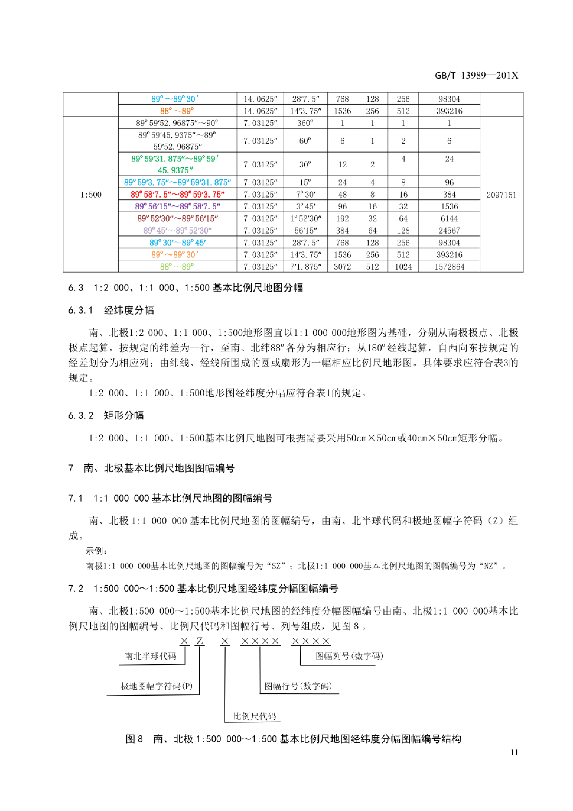

### 6.3 1:2 000, 1:1 000, 1:500 基本比例尺地图分幅

#### 6.3.1 经线分幅

南、北极1:2 000、1:1 000、1:500地图图幅以1:1 000 000地形图为基础，分别从南极极点、北极极点起算，按规定的纬差为一行，至南、北纬88°各分为相应行；从180°经线起算，自西向东按规定的经差划分为相应列；由纬线、经线所围成的圆或扇形为一幅相应比例尺地图。具体要求应符合表3的规定。

1:2 000、1:1 000、1:500地形图经纬度分幅应符合表3的规定。

#### 6.3.2 矩形分幅

1:2 000、1:1 000、1:500基本比例尺地图可根据需要采用50cm×50cm或40cm×50cm矩形分幅。

### 7 南、北极基本比例尺地图图幅编号

#### 7.1 1:1 000 000 基本比例尺地图的图幅编号

南、北极1:1 000 000基本比例尺地图的图幅编号，由南、北半球代码和极地图幅留字符码（Z）组成。

**示例：**

南极1:1 000 000基本比例尺地图的图幅编号为“SZ”；北极1:1 000 000基本比例尺地图的图幅编号为“NZ”。

#### 7.2 1:500 000~1:500 基本比例尺地图经纬度分幅图幅编号

南、北极1:500 000~1:500基本比例尺地图的经纬度分幅图幅编号由南、北极1:1 000 000基本比例尺地图图幅代码、比例尺代码和图幅行号、列号组成，见图8。

**图8 南、北极1:500 000~1:500基本比例尺地图经纬度分幅图幅编号结构**

GB/T 13989—201X

其中：

a) 南、北半球代码：用“N”表示图幅位于北半球，用“S”表示图幅位于南半球；

b) 基本比例尺地图代码按GB/T 13989规定。

c) 南、北极：1:500 000~1:500基本比例尺地图图幅行列编号：

1) 行号：分别从南极点、北极极点起算，按规定的纬差（见表3）划分为相应行，按顺序分别用四位阿拉伯数字（数字符号）表示，不足四位者前面补零；

2) 列号：从180°经线起算，自西向东按规定的经差（见表3）划分为相应列，按顺序分别用四位阿拉伯数字（数字符号）表示，不足四位者前面补零；

3) 取行号在前，列号在后的排列形式标记。

### 7.3 1:1 000 000~1:500基本比例尺地图经纬度分幅图幅编号示例

附录C给出了南、北极1:1 000 000~1:500基本比例尺地图经纬度分幅图幅编号示例。

### 7.4 1:2 000、1:1 000、1:500基本比例尺地图矩形分幅图幅编号

南、北极1:2 000、1:1 000、1:500基本比例尺地图矩形分幅图幅编号见5.3。

### 7.5 1:500 000~1:500基本比例尺地图经纬度分幅图幅编号和图幅经、纬度计算

南、北极1:1 000 000~1:500基本比例尺地图图幅编号和图幅经、纬度计算见附录D。

# 附录 A
## （资料性）
### 1:500 000～1:500 基本比例尺地图（南、北极除外）经纬度分幅图幅编号示例

### A.1 1:500 000 基本比例尺地图图幅编号示例

1:500 000基本比例尺地图的图幅编号示例如图A.1。其中，图a)给出了北半球的东半球（中国区域）图幅编号示例，图中灰色区域所示图幅编号为J5B00010002;图b)给出了北半球的西半球图幅编号示例，图中灰色区域所示图幅编号为J1J1B00010002;图c)给出了南半球的东半球图幅编号示例，图中灰色区域所示图幅编号为J5J5B00010002。

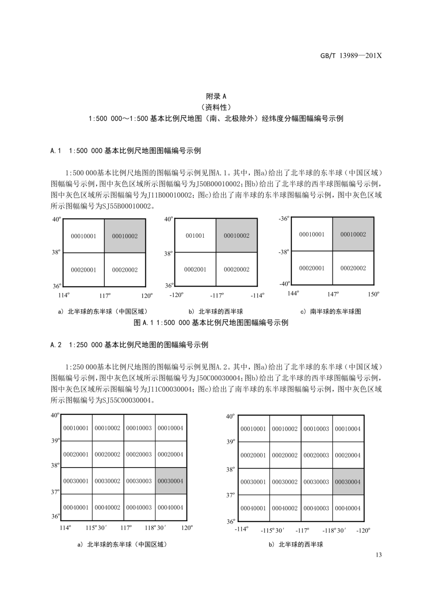

a) 北半球的东半球（中国区域）  
b) 北半球的西半球  
c) 南半球的东半球图  

图 A.1 1:500 000 基本比例尺地图图幅编号示例

### A.2 1:250 000 基本比例尺地图的图幅编号示例

1:250 000基本比例尺地图的图幅编号示例如图A.2。其中，图a)给出了北半球的东半球（中国区域）图幅编号示例，图中灰色区域所示图幅编号为J5C00030004;图b)给出了北半球的西半球图幅编号示例，图中灰色区域所示图幅编号为J1J1C00030004;图c)给出了南半球的东半球图幅编号示例，图中灰色区域所示图幅编号为J5J5C00030004。

a) 北半球的东半球（中国区域）  
b) 北半球的西半球

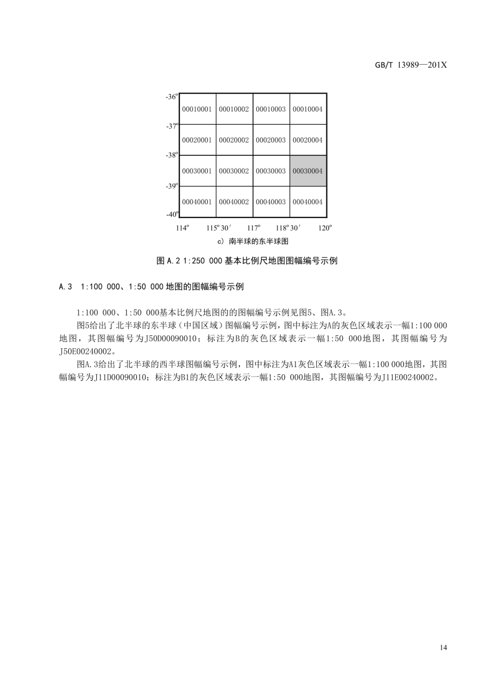

图 A.2 1:250 000 基本比例尺地图幅编号示例

A.3 1:100 000、1:50 000 地图的图幅编号示例

1:100 000、1:50 000基本比例尺地图的图幅编号示例见图5、图A.3。

图5给出了北半球的东半球（中国区域）图幅编号示例，图中标注为A1的灰色区域表示一幅1:100 000地图，其图幅编号为J50D000900010；标注为B1的灰色区域表示一幅1:50 000地图，其图幅编号为J50E002400020。

图A.3给出了北半球的西半球图幅编号示例，图中标注为A1灰色区域表示一幅1:100 000地图，其图幅编号为J11D000900010；标注为B1的灰色区域表示一幅1:50 000地图，其图幅编号为J11E002400020。

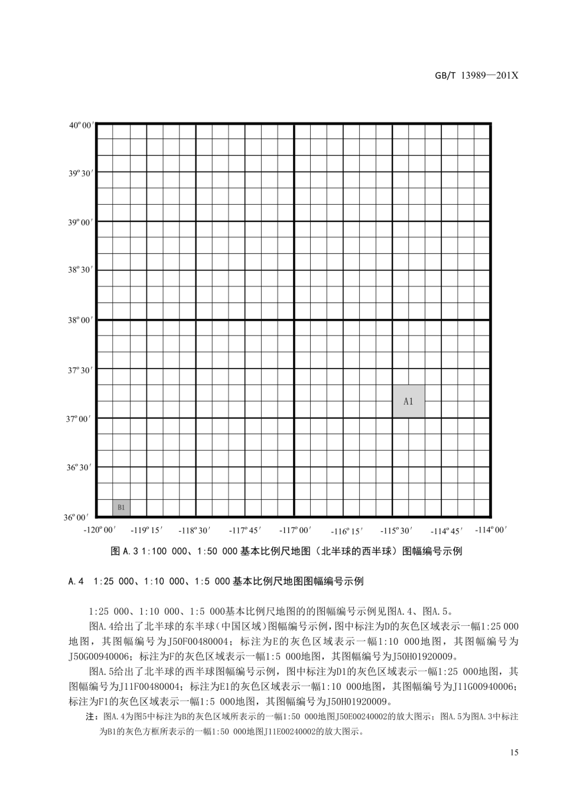

图 A.3 1:100 000、1:50 000 基本比例尺地图（北半球的西半球）图幅编号示例

A.4 1:25 000、1:10 000、1:5 000 基本比例尺地图图幅编号示例

1:25 000、1:10 000、1:5 000 基本比例尺地图的图幅编号示例见图 A.4、图 A.5。  
图 A.4 给出了北半球的东半球（中国区域）图幅编号示例，图中标注为D的灰色区域表示 1:25 000 地图，其图幅编号为 J50F00480004；标注为E的灰色区域表示 1:10 000 地图，其图幅编号为 J50G00940006；标注为F的灰色区域表示 1:5 000 地图，其图幅编号为 J50H01920009。  
图 A.5 给出了北半球的西半球图幅编号示例，图中标注为D的灰色区域表示 1:25 000地图，其图幅编号为 JI10F00480004；标注为E的灰色区域表示 1:10 000地图，其图幅编号为 JI10G00940006；标注为F的灰色区域表示 1:5 000地图，其图幅编号为 JI10H01920009。

注：图 A.4 的图名标注为附录B标准示例一幅：1:50 000地图J50E00420020的放大图示；图A.5为附录B.3标准为1的灰色方框所表示的一幅：1:50 000地图JI10E00420020的放大图示。

GB/T 13989—201X

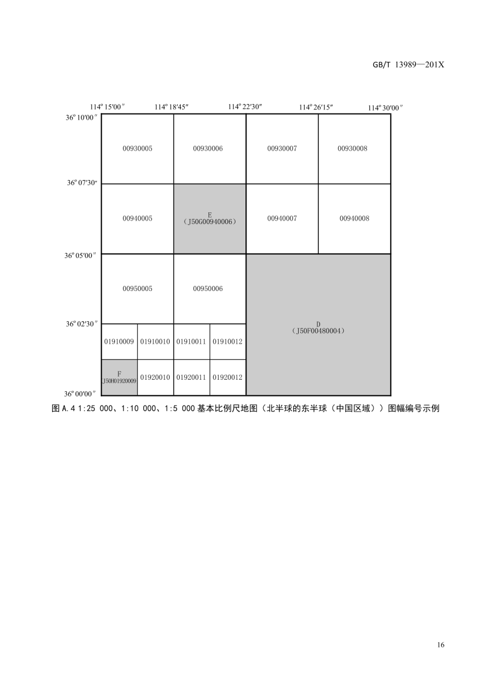

图 A.4 1:25 000、1:10 000、1:5 000 基本比例尺地图（北半球的东半球《中国区域》）图幅编号示例

GB/T 13989—201X

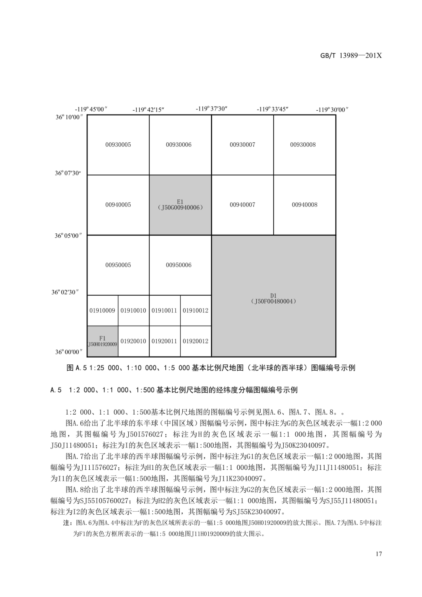

图 A.5 1:25 000、1:10 000、1:5 000 基本比例尺地图（北半球的西半球）图幅编号示例

A.5 1:20 000、1:10 000、1:5 000 基本比例尺地图的经纬度分幅图幅编号示例

1:2 000、1:1 000、1:500基本比例尺地图的图幅编号示例见图A.6、图A.7、图A.8。

图A.6给出了北半球的东半球（中国区域）图幅编号示例，图中标注为J的灰色区域表示——幅1:2 000地图，其图幅编号为J501576027；标注为I的灰色区域表示——幅1:1 000地图，其图幅编号为J50J11480051；标注为H的灰色区域表示——幅1:500地图，其图幅编号为J50K23040097。

图A.7给出了北半球的西半球图幅编号示例，图中标注为J的灰色区域表示——幅1:2 000地图，其图幅编号为J511576027；标注为I的灰色区域表示——幅1:1 000地图，其图幅编号为J5111480051；标注为H的灰色区域表示——幅1:500地图，其图幅编号为J511K23040097。

图A.8给出了北半球的南半球图幅编号示例，图中标注为J的灰色区域表示——幅1:2 000地图，其图幅编号为J55J50756027；标注为I的灰色区域表示——幅1:1 000地图，其图幅编号为J55J11480051；标注为H的灰色区域表示——幅1:500地图，其图幅编号为J55K23040097。

注：图A.6的图A.4中标注为I的灰色区域表示为——幅1:5 000地图其J50J19200009的放大图示。图A.7为图A.5中标注为I的灰色无框区域表示——幅1:5 000地图其J110J19200009的放大图示。

GB/T 13989—201X

114°15′00″ | 114°15′37.5″ | 114°16′15″ | 114°16′52.5″
36°01′15″
11470049 | 11470050 | 11470051 | 11470052 | 11470053 | 11470054
11480049 | 11480050 | **H** | 11480052 | 11480053 | 11480054
| | **J50J11480051** | | | | 
36°00′50″
11490049 | 11490050 | 11490051 | 11490052 | 11490053 | 11490054
11500049 | 11500050 | 11500051 | 11500052 | 11500053 | 11500054
36°00′25″
23010097 | 23010098 | 23010099 | 23010100 | 23010101 | 23010102 | 23010103 | 23010104
23020097 | 23020098 | 23020099 | 23020100 | 23020101 | 23020102 | 23020103 | 23020104
23030097 | 23030098 | 23030099 | 23030100 | 23030101 | 23030102 | 23030103 | 23030104
36°00′00″
**I** | 23040098 | 23040099 | 23040100 | 23040101 | 23040102 | 23040103 | 23040104
**J50J05760027** | | | | | | | 

**G**
**(J50105760027)**

图 A.6 1:2 000, 1:1 000, 1:500 基本比例尺地图（北半球的东半球（中国区域））

经、纬度分幅图幅编号示例

GB/T 13989—201X

11470049 | 11470050 | 11470051 | 11470052 | 11470053 | 11470054
--- | --- | --- | --- | --- | ---
11480049 | 11480050 | H1 (J11J11480051) | 11480052 | 11480053 | 11480054
11490049 | 11490050 | 11490051 | 11490052 | 11490053 | 11490054
11500049 | 11500050 | 11500051 | 11500052 | 11500053 | 11500054
23010097 | 23010098 | 23010099 | 23010100 | 23010101 | 23010102 | 23010103 | 23010104
23020097 | 23020098 | 23020099 | 23020100 | 23020101 | 23020102 | 23020103 | 23020104
23030097 | 23030098 | 23030099 | 23030100 | 23030101 | 23030102 | 23030103 | 23030104
I1 (J11J23040097) | 23040098 | 23040099 | 23040100 | 23040101 | 23040102 | 23040103 | 23040104
G1 (J11J1576027)

图 A.7 1:2 000，1:1 000，1:500 基本比例尺地图（北半球的西半球）经、纬度分幅图幅编号示例

GB/T 13989—201X

114°15′00″ | 114°15′37.5″ | 114°16′15″ | 114°16′52.5″  
-39°58′45″  
11470049 | 11470050 | 11470051 | 11470052 | 11470053 | 11470054  
-39°59′10″  
11480049 | 11480050 | H2 (SJ55J11480051) | 11480052 | 11480053 | 11480054  
-39°59′35″  
11490049 | 11490050 | 11490051 | 11490052 | 11490053 | 11490054  
11500049 | 11500050 | 11500051 | 11500052 | 11500053 | 11500054  
23010097 | 23010098 | 23010099 | 23010100 | 23010101 | 23010102 | 23010103 | 23010104  
23020097 | 23020098 | 23020099 | 23020100 | 23020101 | 23020102 | 23020103 | 23020104  
23030097 | 23030098 | 23030099 | 23030100 | 23030101 | 23030102 | 23030103 | 23030104  
I2 (SJ75J23040097) | 23040098 | 23040099 | 23040100 | 23040101 | 23040102 | 23040103 | 23040104  
G2 (SJ55J105760027)

图 A.8 1:2 000, 1:1 000, 1:500 基本比例尺地图（南半球的东半球）经、纬度分幅图幅编号示例

## 附录 B
### 基本比例尺地图（南、北极除外）经纬度分幅图幅编号和图幅经、纬度计算

### B.1 已知图幅内某点的经、纬度计算其编号

#### B.1.1 1:1 000 000地图图幅编号的计算

##### B.1.1.1 计算公式

已知图幅内某点的经、纬度，计算1:1 000 000地图图幅编号公式见式B.1、B.2。

$$
a = \left\lfloor \frac{\varphi}{4^\circ} \right\rfloor + 1 \quad \cdots \cdots \cdots \cdots \cdots \cdots \cdots \cdots \cdots \cdots \cdots \cdots \cdots \cdots \cdots \cdots \cdots \cdots \cdots \cdots \cdots \cdots \cdots \cdots \cdots \cdots \cdots \cdots \cdots \cdots \cdots \cdots \cdots \cdots \cdots \cdots \cdots \cdots (B.1)
$$

$$
b = \left\lfloor \frac{(\lambda - hf)}{6^\circ n} \right\rfloor \times EW + d0 \quad \cdots \cdots \cdots \cdots \cdots \cdots \cdots \cdots \cdots \cdots \cdots \cdots \cdots \cdots \cdots \cdots \cdots \cdots \cdots \cdots \cdots \cdots \cdots \cdots \cdots \cdots \cdots \cdots \cdots \cdots \cdots \cdots \cdots \cdots \cdots \cdots \cdots \cdots \cdots \cdots \cdots \cdots \cdots \cdots \cdots \cdots \cdots \cdots \cdots \cdots \cdots \cdots \cdots \cdots \cdots \cdots \cdots \cdots \cdots \cdots \cdots \cdots \cdots \cdots \cdots \cdots \cdots \cdots \cdots \cdots \cdots \cdots \cdots \cdots \cdots \cdots \cdots \cdots \cdots \cdots \cdots \cdots \cdots \cdots \cdots \cdots \cdots \cdots \cdots \cdots \cdots \cdots \cdots \cdots \cdots \cdots \cdots \cdots \cdots \cdots \cdots \cdots \cdots \cdots \cdots \cdots \cdots \cdots \cdots \cdots \cdots \cdots \cdots \cdots \cdots \cdots \cdots \cdots \cdots \cdots \cdots \cdots \cdots \cdots \cdots \cdots \cdots \cdots \cdots \cdots \cdots \cdots \cdots \cdots \cdots \cdots \cdots \cdots \cdots \cdots \cdots \cdots \cdots \cdots \cdots \cdots \cdots \cdots \cdots \cdots \cdots \cdots \cdots \cdots \cdots \cdots \cdots \cdots \cdots \cdots \cdots \cdots \cdots \cdots \cdots \cdots \cdots \cdots \cdots \cdots \cdots \cdots \cdots \cdots \cdots \cdots \cdots \cdots \cdots \cdots \cdots \cdots \cdots \cdots \cdots \cdots \cdots \cdots \cdots \cdots \cdots \cdots \cdots \cdots \cdots \cdots \cdots \cdots \cdots \cdots \cdots \cdots \cdots \cdots \cdots \cdots \cdots \cdots \cdots \cdots \cdots \cdots \cdots \cdots \cdots \cdots \cdots \cdots \cdots \cdots \cdots \cdots \cdots \cdots \cdots \cdots \cdots \cdots \cdots \cdots \cdots \cdots \cdots \cdots \cdots \cdots \cdots \cdots \cdots \cdots \cdots \cdots \cdots \cdots \cdots \cdots \cdots \cdots \cdots \cdots \cdots \cdots \cdots \cdots \cdots \cdots \cdots \cdots \cdots \cdots \cdots \cdots \cdots \cdots \cdots \cdots \cdots \cdots \cdots \cdots \cdots \cdots \cdots \cdots \cdots \cdots \cdots \cdots \cdots \cdots \cdots \cdots \cdots \cdots \cdots \cdots \cdots \cdots \cdots \cdots \cdots \cdots \cdots \cdots \cdots \cdots \cdots \cdots \cdots \cdots \cdots \cdots \cdots \cdots \cdots \cdots \cdots \cdots \cdots \cdots \cdots \cdots \cdots \cdots \cdots \cdots \cdots \cdots \cdots \cdots \cdots \cdots \cdots \cdots \cdots \cdots \cdots \cdots \cdots \cdots \cdots \cdots \cdots \cdots \cdots \cdots \cdots \cdots \cdots \cdots \cdots \cdots \cdots \cdots \cdots \cdots \cdots \cdots \cdots \cdots \cdots \cdots \cdots \cdots \cdots \cdots \cdots \cdots \cdots \cdots \cdots \cdots \cdots \cdots \cdots \cdots \cdots \cdots \cdots \cdots \cdots \cdots \cdots \cdots \cdots \cdots \cdots \cdots \cdots \cdots \cdots \cdots \cdots \cdots \cdots \cdots \cdots \cdots \cdots \cdots \cdots \cdots \cdots \cdots \cdots \cdots \cdots \cdots \cdots \cdots \cdots \cdots \cdots \cdots \cdots \cdots \cdots \cdots \cdots \cdots \cdots \cdots \cdots \cdots \cdots \cdots \cdots \cdots \cdots \cdots \cdots \cdots \cdots \cdots \cdots \cdots \cdots \cdots \cdots \cdots \cdots \cdots \cdots \cdots \cdots \cdots \cdots \cdots \cdots \cdots \cdots \cdots \cdots \cdots \cdots \cdots \cdots \cdots \cdots \cdots \cdots \cdots \cdots \cdots \cdots \cdots \cdots \cdots \cdots \cdots \cdots \cdots \cdots \cdots \cdots \cdots \cdots \cdots \cdots \cdots \cdots \cdots \cdots \cdots \cdots \cdots \cdots \cdots \cdots \cdots \cdots \cdots \cdots \cdots \cdots \cdots \cdots \cdots \cdots \cdots \cdots \cdots \cdots \cdots \cdots \cdots \cdots \cdots \cdots \cdots \cdots \cdots \cdots \cdots \cdots \cdots \cdots \cdots \cdots \cdots \cdots \cdots \cdots \cdots \cdots \cdots \cdots \cdots \cdots \cdots \cdots \cdots \cdots \cdots \cdots \cdots \cdots \cdots \cdots \cdots \cdots \cdots \cdots \cdots \cdots \cdots \cdots \cdots \cdots \cdots \cdots \cdots \cdots \cdots \cdots \cdots \cdots \cdots \cdots \cdots \cdots \cdots \cdots \cdots \cdots \cdots \cdots \cdots \cdots \cdots \cdots \cdots \cdots \cdots

GB/T 13989—201X

a = [ (69°22′ 30″ / 4°) + 1 ] = 18（字符码R）
b = [ (128°33′ 45″ - 0°) / 6°×2) ] | ×1 + 16 = 26
该点所在1:1 000 000地图图幅编号为NR26.
示例3:
某点经度为145°33′ 45″，纬度为80°22′ 30″，计算其所在图幅的编号。
φ=80°22′ 30″，λ=145°33′ 45″，n=4，d0=8，hf=-12°，EW=1
a = [ (80°22′ 30″ / 4°) + 1 ] = 21（字符码U）
b = [ ((145°33′ 45″ +12°) / 6°×4) ] | ×1 + 8 = 14
该点所在1:1 000 000地图图幅编号为NU14.

B.1.1.2.2 已知点位于北半球的西半球

以下分别给出已知点位于纬度0°～60°、60°～76°、76°～88°之间时，1:1 000 000地图图幅编号计算示例如下。
示例1:
某点经度为114°33′ 45″，纬度为39°22′ 30″，计算其所在图幅的编号。
φ=39°22′ 30″，λ=114°33′ 45″，n=1，d0=31，hf=0°，EW=-1
a = [ (39°22′ 30″ / 4°) + 1 ] = 10（字符码J）
b = [ ((-114°33′ 45″ -0°) / 6°) ] × (-1) + 31 = 11
该点所在1:1 000 000地图图幅编号为NJ11.
示例2:
某点经度为128°33′ 45″，纬度为69°22′ 30″，计算其所在图幅的编号。
φ=69°22′ 30″，λ=128°33′ 45″，n=2，d0=16，hf=0°，EW=-1
a = [ (69°22′ 30″ / 4°) + 1 ] = 18（字符码R）
b = [ ((-128°33′ 45″ -0°) / 6°×2) ] | ×1 + 16 =5
该点所在1:1 000 000地图图幅编号为NR05.
示例3:
某点经度为145°33′ 45″，纬度为80°22′ 30″，计算其所在图幅的编号。
φ=80°22′ 30″，λ=145°33′ 45″，n=4，d0=8，hf=-12°，EW=-1
a = [ (80°22′ 30″ / 4°) + 1 ] = 21（字符码U）
b = [ ((-145°33′ 45″ +12°) / 6°×4) ] | ×1 +8 =2
该点所在1:1 000 000地图图幅编号为NU02.

B.1.1.2.3 已知点位于南半球的东半球

以下分别给出已知点位于纬度0°～60°、60°～76°、76°～88°之间时，1:1 000 000地图图幅编号计算示例如下。
示例1:
某点经度为114°33′ 45″，纬度为51°22′ 30″，计算其所在图幅的编号。
φ=51°22′ 30″，λ=114°33′ 45″，n=1，d0=31，hf=0°，EW=1
a = [ (51°22′ 30″ / 4°) + 1 ] = 13（字符码M）
b = [ ((114°33′ 45″ -0°) / 6°) ] ×1 + 31 = 50
该点所在1:1 000 000地图图幅编号为SM50.
示例2:
某点经度为128°33′ 45″，纬度为69°22′ 30″，计算其所在图幅的编号。

GB/T 13989—201X

$$
\phi = 69^\circ 22' 30'', \lambda = 128^\circ 33' 45'', n = 2, d0 = 16, hf = 0^\circ, EW = 1
$$

$$
a = [(-69^\circ 22' 30''/4) + 1 = 18 \quad (\text{字符码}R)]
$$

$$
b = [(\lambda 128^\circ 33' 45'' - 0^\circ)/(6^\circ \times 2)] \times X1 + 16 = 26
$$

该点所在1:1 000 000地图图幅号为JR26.

示例3:

某点经度为145^\circ 33' 45'', 纬度为82^\circ 22' 30'', 计算其所在图幅的编号。

$$
\phi = 82^\circ 22' 30'', \lambda = 145^\circ 33' 45'', n = 4, d0 = 8, hf = 12^\circ, EW = 1
$$

$$
a = [(-82^\circ 22' 30''/4) + 1 = 21 \quad (\text{字符码}U)]
$$

$$
b = [(\lambda 145^\circ 33' 45'' - 12^\circ)/(6^\circ \times 4)] \times X1 + 8 = 14
$$

该点所在1:1 000 000地图图幅号为SU14.

### B.1.1.2.4 已知点位于南半球的西半球

以下分别给出已知点子纬度0^\circ \sim 60^\circ、60^\circ \sim 76^\circ、76^\circ \sim 88^\circ 之间时, 1:1 000 000地图图幅编号计算示例如下。

示例1:

某点经度为114^\circ 33' 45'', 纬度为39^\circ 22' 30'', 计算其所在图幅的编号。

$$
\phi = 39^\circ 22' 30'', \lambda = 114^\circ 33' 45'', n = 1, d0 = 31, hf = 0^\circ, EW = -1
$$

$$
a = [(-39^\circ 22' 30''/4) + 1 = 10 \quad (\text{字符码}L)]
$$

$$
b = [(-114^\circ 33' 45'' - 0^\circ)/6^\circ] \times (-1) + 31 = 11
$$

该点所在1:1 000 000地图图幅号为JSJ11.

示例2:

某点经度为128^\circ 33' 45'', 纬度为69^\circ 22' 30'', 计算其所在图幅的编号。

$$
\phi = 69^\circ 22' 30'', \lambda = 128^\circ 33' 45'', n = 2, d0 = 16, hf = 0^\circ, EW = -1
$$

$$
a = [(-69^\circ 22' 30''/4) + 1 = 18 \quad (\text{字符码}R)]
$$

$$
b = [(-128^\circ 33' 45'' - 0^\circ)/(6^\circ \times 2)] \times (-1) + 16 = 5
$$

该点所在1:1 000 000地图图幅号为JSJ05.

示例3:

某点经度为145^\circ 33' 45'', 纬度为80^\circ 22' 30'', 计算其所在图幅的编号。

$$
\phi = 80^\circ 22' 30'', \lambda = 145^\circ 33' 45'', n = 4, d0 = 8, hf = 12^\circ, EW = -1
$$

$$
a = [(-80^\circ 22' 30''/4) + 1 = 21 \quad (\text{字符码}U)]
$$

$$
b = [(-145^\circ 33' 45'' - 12^\circ)/(6^\circ \times 4)] \times (-1) + 8 = 2
$$

该点所在1:1 000 000地图图幅号为JSU02.

### B.1.2 1:500 000 \sim 1:500 000地图图幅编号的计算

#### B.1.2.1 计算公式

已知图幅内某点的经、纬度, 计算1:500 000 \sim 1:500 000地图图幅编号按式B.3、B.4.

$$
c = [nn] + C[nn-nn] \quad \text{............................................. (B.3)}
$$

$$
d = [(\lambda - t1)/\lambda \lambda] + 1 \quad \text{............................................. (B.4)}
$$

其中,

$$
t1 = (b - d0) \times 6^\circ n^\circ hf
$$

tb = (a -1 + SN1) X 4° X SN;
nn=(tb - Φ )△Φ

式中:
()——用于加减法运算时，表示运算优先;
C[ ]——表示取整，向上取整;
[ ]——表示向取整，向下取整;
a——1:100 000地图幅所在纬度带字符所对应的数字码;
b=1:100 000地图幅所在经度带的数字码;
c——所求比例尺地图1:1 000 000地图图号后的行号;
d——所求比例尺地图1:1 000 000地图图号后的列号;
λ——图幅内东点的经度图幅西南图廓点的经度;
Φ——图幅内东点的纬度图幅西南图廓点的纬度;
△λ——所求比例尺地图的简纬差;
△Φ——所求比例尺地图的简纬差;
N——高纬度区可用经差补充个位数，当纬度值位于0°~60°，取值为1，当纬度值位于60°~76°，取值为2，当纬度值为76°~88°，取值为4;
d0——东半球或西半球经差的列号，当纬度60°~60°，取值为31，当纬度60°~76°，取值为16，当纬度76°~88°，取值为8;
Hf——幅面所有百万图幅西南角与中央子午线的差距，默认为0无差距，纬度76°~88°为-12°，中央子午线在高纬度西方向（列号为8）的中央;
SN——南北半球标号。北半球为1，南半球为-1,即南半球的纬度坐标取负数;
SN1——南北半球计算间节值。北半球取值为1，南半球时取值为0.

### B.1.2.2 计算示例

#### B.1.2.2.1 已知点位于北半球的东半球的纬度0°~60°之间

以经度为114°33′45″，纬度为39°22′30″的已知点为例，其所在1:500 000~1:500地图库幅编号计算示例如下。

**示例1:**

计算1:500 000地图的编号

$$Φ=39°22′30″，λ=114°33′45″，n=1，d0=31，hf=0°，△Φ=2°，△λ=3°，SN=1，SN1=1$$

按照公式1和B.2计算得a=10（字符码），b=50

$$t1=(50-31) X 60 X 1-0=114°$$

$$tb=(10-1+1) X 4° X 1= 40°$$

$$nn=(tb - Φ )△Φ = (40°- 39°22′30″)/2°=0.3125$$

$$c=[0.3125]+C[0.3125-10.3125]$$

$$=0+1$$

$$=1$$

$$d=[(114°33′45″-114°)/3°]+1$$

$$=0+1$$

$$=1$$

因此，1:500 000地图编号为NJ50B00010001。

**示例2:**

计算1:100 000地图的编号

GB/T 13989—201X

$$
\Phi = 39^\circ 22' 30'', \lambda = 114^\circ 33' 45'', n = 1, d_0 = 31, h_f = 0^\circ, \Delta \Phi = 20', \Delta \lambda = 30', SN = 1, SN_1 = 1
$$

按照美国1:1地图，2计算得出a=10（字符码J）, b=50

$$
t_1 = (50-31) \times 6^\circ \times 10^\circ = 114^\circ
$$
$$
t_b = (10+1+1) \times 4^\circ \times 1^\circ = 40^\circ
$$
$$
nn = (t_b - \Phi) / \Delta \Phi < (40^\circ - 39^\circ 22' 30'') / 20' = 1.875
$$
$$
c = [1.875] + c[1.875 - [1.875]]
$$
$$
= 1+1
$$
$$
= 2
$$
$$
d = ([114^\circ 33' 45'' - 114^\circ] / 30') + 1
$$
$$
= 1 + 1
$$
$$
= 2
$$

因此，1:100 000地图的编号为NJ50D00020002。

示例3：

计算1:25 000地图的编号

$$
\Phi = 39^\circ 22' 30'', \lambda = 114^\circ 33' 45'', n = 1, d_0 = 31, h_f = 0^\circ, \Delta \Phi = 5', \Delta \lambda = 7' 30'', n = 1, SN = 1, SN_1 = 1
$$

按照美国1:1地图，2计算得出a=10（字符码J）, b=50

$$
t_1 = (50-31) \times 6^\circ \times 10^\circ = 114^\circ
$$
$$
t_b = (10+1+1) \times 4^\circ \times 1^\circ = 40^\circ
$$
$$
nn = (t_b - \Phi) / \Delta \Phi < (40^\circ - 39^\circ 22' 30'') / 5' = 7.5
$$
$$
c = [7.5] + c[7.5 - [7.5]]
$$
$$
= 7+1
$$
$$
= 8
$$
$$
d = ([114^\circ 33' 45'' - 114^\circ] / 7' 30'') + 1
$$
$$
= 4+1
$$
$$
= 5
$$

因此，1:25 000地图的编号为NJ50F00080005。

示例4：

计算1:1 000地图的编号

$$
\Phi = 39^\circ 22' 30'', \lambda = 114^\circ 33' 45'', n = 1, d_0 = 31, h_f = 0^\circ, \Delta \Phi = 12.5'', \Delta \lambda = 18.75'', n = 1, SN = 1, SN_1 = 1
$$

按照美国1:1地图，2计算得出a=10（字符码J）, b=50

$$
t_1 = (50-31) \times 6^\circ \times 10^\circ = 114^\circ
$$
$$
t_b = (10+1+1) \times 4^\circ \times 1^\circ = 40^\circ
$$
$$
nn = (t_b - \Phi) / \Delta \Phi < (40^\circ - 39^\circ 22' 30'') / 12.5'' = 180
$$
$$
c = [180] + c[180 - [180]]
$$
$$
= 180+0
$$
$$
= 180
$$
$$
d = ([114^\circ 33' 45'' - 114^\circ] / 18.75'') + 1
$$
$$
= 108+1
$$
$$
= 109
$$

因此，1:1 000地图的编号为NJ50J01800109。

B.1.2.2.2 已知点位于北半球的东半球的纬度60°～76°之间

GB/T 13989—201X

以经度为114°33′45″，纬度为66°22′30″的已知点为例，其所在1:500 000~1:500 000地图图幅编号计算示例如下。

示例1:

计算1:500 000地图的编号

φ=66°22′30″，λ=114°33′45″,n=2,d0=16,hf=0°,Δφ=2°,Δλ=6°,SN=1,SN1=1

按照公式B.1和B.2计算得出n=17(字符码Q),b=25

t1=(25-16)X6°X2°0=108°

tb=(17+1)X4°X1=68°

nn=(tb-φ)/Δφ=(68°-66°22′30″)/2°=0.8125

c=[0.8125]+c[0.8125-0.8125]

=0+1

=1

d=[(114°33′45″-108°)/6°]+1

=1+1

=2

因此，1:500 000地图的图号为NQ25B00010002。

示例2:

计算1:500 000地图的编号

φ=66°22′30″，λ=114°33′45″,n=2,d0=16,hf=0°,Δφ=10′,Δλ=30′,SN=1,SN1=1

按照公式B.1和B.2计算得出n=17(字符码Q),b=25

t1=(25-16)X6°X2°0=108°

tb=(17+1)X4°X1=68°

nn=(tb-φ)/Δφ=(68°-66°22′30″)/10′=9.75

c=[9.75]+c[9.75-9.75]

=9+1

=10

d=[(114°33′45″-108°)/30′]+1

=13+1

=14

因此，1:500 000地图的图号为NQ25E00100014。

示例3:

计算1:5 000地图的编号

φ=66°22′30″，λ=114°33′45″,n=2,d0=16,hf=0°,Δφ=1′15″,Δλ=3′45″,SN=1,SN1=1

按照公式B.1和B.2计算得出n=17(字符码Q),b=25

t1=(25-16)X6°X2°0=108°

tb=(17+1)X4°X1=68°

nn=(tb-φ)/Δφ=(68°-66°22′30″)/1′15″=78

c=[78]+c[78-78]]

=78+0

=78

d=[(114°33′45″-108°)/3′45″]+1

=1

GB/T 13989—201X

= 105 + 1

= 106

因此, 1:5 000地图库的图号为N025H007801006。

示例4:

计算1:1 000地图库的编号

$$
\Phi = 66^\circ 22' 30", \lambda = 114^\circ 33' 45", n = 2, d0 = 16, hf = 0^\circ, \Delta \Phi = 12.5', \Delta \lambda = 37.5',
$$

$$
SN = 1, SN1 = 1
$$

按照公式1和B. 2计算得出a=17 (字符码Q), b=25

$$
t1 = (25-16) \times 6^\circ \times 2 = 108^\circ
$$

$$
tb = (17-1+1) \times 4^\circ \times 1 = 68^\circ
$$

$$
nn = (tb - \Phi) / \Delta \Phi = (68^\circ - 66^\circ 22' 30") / 12.5' = 468
$$

$$
c = [750] + C[750 - [750]]
$$

$$
= 468 + 0
$$

$$
= 468
$$

$$
d = ([114^\circ 33' 45" - 108^\circ] / 37.5') + 1
$$

$$
= 630 + 1
$$

$$
= 631
$$

因此, 1:1 000地图库的图号为N025J04680631。

B.1.2.2.3 已知点位于北半球的东半球且位于纬度76° ~ 88°之间

以经度为114° 33' 45", 纬度为80° 22' 30" 的已知点为例, 其所在1:500 000~1:500地图库编号计算示例如下。

示例1:

计算1:500 000地图库的编号

$$
\Phi = 80^\circ 22' 30", \lambda = 114^\circ 33' 45", n = 4, d0 = 8, hf = 12^\circ, \Delta \Phi = 2^\circ, \Delta \lambda = 12^\circ,
$$

$$
SN = 1, SN1 = 1
$$

按照公式1和B. 2计算得出a=21 (字符码U), b=13

$$
t1 = (13-8) \times 6^\circ \times 4 = 108^\circ
$$

$$
tb = (21-1+1) \times 4^\circ \times 1 = 84^\circ
$$

$$
nn = (tb - \Phi) / \Delta \Phi = (84^\circ - 80^\circ 22' 30") / 2^\circ = 1.8125
$$

$$
c = [1.8125] + C[1.8125 - [1.8125]]
$$

$$
= 1 + 1
$$

$$
= 2
$$

$$
d = ([114^\circ 33' 45" - 108^\circ] / 12^\circ) + 1
$$

$$
= 0 + 1
$$

$$
= 1
$$

因此, 1:500 000地图库的图号为NJI3B000200001。

示例2:

计算1:100 000地图库的编号

$$
\Phi = 80^\circ 22' 30", \lambda = 114^\circ 33' 45", n = 4, d0 = 8, hf = 12^\circ, \Delta \Phi = 20', \Delta \lambda = 2^\circ,
$$

$$
SN = 1, SN1 = 1
$$

按照公式1和B. 2计算得出a=21 (字符码U), b=13

$$
t1 = (13-8) \times 6^\circ \times 4 = 108^\circ
$$

tb = (2I-1+1) X 4° X 1 = 84°

nn=(tb-Δφ) / Δλ = ( 84° - 80° 22' 30'' ) / 20' = 10.875

c = [10.875] + C[10.875 - [10.875]] 
   = 10+1
   = 11

d = ( [[14°33' 45'' - 108° ) / 2° ] + 1 
   = 3+1
   = 4

因此，1:100 000地图的图号为NIJ3D00110004。

示例3:
计算1:5 000地图的编号
φ = 80° 22' 30''，λ = 114° 33' 45''，n = 4，d0 = 8，hf = 12°，Δφ = 1' 15''，Δλ = 7' 30''，SN=1，SN1=1
按图公式B.1和B.2计算得出a=21（字符码U），b=13
t1 = (13-8) X 6° X 4-12 = 108°

tb = (2I-1+1) X 4° X 1 = 84°

nn=(tb-Δφ) / Δλ = ( 84° - 80° 22' 30'' ) / 1' 15'' = 174

c = [174] + C[174 - [174]]
   = 174+0
   = 174

d = ( [[14°33' 45'' - 108° ) / 7° 30' ] + 1 
   = 52+1
   = 53

因此，1:5 000地图的图号为NIJ3H01740053。

示例4:
计算1:1 000地图的编号
φ = 80° 22' 30''，λ = 114° 33' 45''，n = 4，d0 = 8，hf = 12°，Δφ = 12.5''，Δλ = 1' 15''，SN=1，SN1=1
按图公式B.1和B.2计算得出a=21（字符码U），b=13
t1 = (13-8) X 6° X 4-12 = 108°

tb = (2I-1+1) X 4° X 1 = 84°

nn=(tb-Δφ) / Δλ = ( 84° - 80° 22' 30'' ) / 12.5'' = 1044

c = [1044] + C[1044 - [1044]]
   = 1044+0
   = 1044

d = ( [[14°33' 45'' - 108° ) / 1' 15'' ] + 1 
   = 315+1
   = 316

因此，1:1 000地图的图号为NIJ3J10440316。

B.1.2.2.4 已知点位于北半球的西半球经度0°～60°之间
以经度为λ=114° 33' 45''，纬度为39° 22' 30'' 的已知点为例，其所在1:500 000～1:500地图图幅编号计算示例如下。

示例1:
计算1:500 000地图的编号
φ=39°22′30″，λ=114°33′45″，n=1，d0=31，hf=0°，Δφ=2°，Δλ=3°，SN=1，SN1=1
按照公式B.1和B.2计算得出a=10（字符码J），b=11
$$
t1=(11-31)×6°×1+0=-120°
$$
$$
tb=(10+1+1)×4°×1=40°
$$
$$
nn=(tb-φ)/Δφ=(40°-39°22′30″)/2°≒0.3125
$$
$$
c=[0.3125]≠[0.3125-[0.3125]]
$$
$$
=0+1
$$
$$
=1
$$
$$
d=[(-114°33′45″+120°)/3°]+1
$$
$$
=1+1
$$
$$
=2
$$
因此，1:500 000地图的图号为NJ11B00010002。

示例2:
计算1:100 000地图的编号
φ=39°22′30″，λ=114°33′45″，n=1，d0=31，hf=0°，Δφ=20′，Δλ=30′，SN=1，SN1=1
按照公式B.1和B.2计算得出a=10（字符码J），b=11
$$
t1=(11-31)×6°×1+0=-120°
$$
$$
tb=(10+1+1)×4°×1=40°
$$
$$
nn=(tb-φ)/Δφ=(40°-39°22′30″)/20′≒1.875
$$
$$
c=[1.875]≠[1.875-[1.875]]
$$
$$
=1+1
$$
$$
=2
$$
$$
d=[(-114°33′45″+120°)/30′]+1
$$
$$
=10+1
$$
$$
=11
$$
因此，1:100 000地图的图号为NJ11D00020011。

示例3:
计算1:25 000地图的编号
φ=39°22′30″，λ=114°33′45″，n=1，d0=31，hf=0°，Δφ=5′，Δλ=7′30″，SN=1，SN1=1
按照公式B.1和B.2计算得出a=10（字符码J），b=11
$$
t1=(11-31)×6°×1+0=-120°
$$
$$
tb=(10+1+1)×4°×1=40°
$$
$$
nn=(tb-φ)/Δφ=(40°-39°22′30″)/5′≒7.7
$$
$$
c=[7.7]≠[7.7-[7.7]]
$$
$$
=7+1
$$
$$
=8
$$
$$
d=[(114°33′45″+120°)/7′30″]+1
$$
$$
=43+1
$$
$$
=44
$$
因此，1:25 000地图的图号为NJ11D00020011。

GB/T 13989—201X

因此，1:25 000地图的编号为NJ11F00800044。

示例4:

计算1:1 000地图的编号

φ=39°22′ 30″，λ=114°33′ 45″，n=1，d0=31，hf=0°，Δ φ= 12.5″，Δ λ = 18.75″，

SN=1，SN1=1

按照公式B.1和B.2计算得出a=10（字符码J），b=11

tl = (11-31) X6° X10÷120°

tb = (10+11) X4° X12÷10°

nn=(tb-Φ) / Δ Φ= (40° - 39°22′ 30″ ) / 12.5″ =180

c = [180]+C[180–[180]]

= 180+0

= 180

d = [(114°33′ 45″ ÷120° ) / 18.75″ ] + 1

= 1044 + 1

= 1045

因此，1:1 000地图的编号为NJ11J01801045。

B.1.2.2.5 已知点位于北半球的西半球纬度60° ～76° 之间

以经度为-114° 33′ 45″，纬度为66° 22′ 30″ 的已知点为例，其所在1:500 000～1:500地图幅编号计算示例如下。

示例1:

计算1:500 000地图的编号

φ=66°22′ 30″，λ=114° 33′ 45″，n=2，d0=16，hf=0°，Δ φ= 2″，Δ λ = 6″，SN=1，SN1=1

按照公式B.1和B.2计算得出a=17（字符码Q），b=6

tl = (6-16) X6° X20÷120°

tb = (17-1+1) X4° X12÷60°

nn=(tb-Φ) / Δ Φ= (68°–66°22′ 30″ ) /2° =0.8125

c = [0.8125]+C[0.8125–[0.8125]]

= 0+1

= 1

d = [(–114°33′ 45″ ÷120° ) /6″] + 1

= 0 + 1

= 1

因此，1:500 000地图的编号为NQ06B00010001。

示例2:

计算1:500 000地图的编号

φ=66°22′ 30″，λ=114° 33′ 45″，n=2，d0=16，hf=0°，Δ φ= 10′，Δ λ = 30′，

SN=1，SN1=1

按照公式B.1和B.2计算得出a=17（字符码Q），b=6

tl = (6-16) X6° X20÷120°

tb = (17+1) X4° X12÷60°

nn=(tb-Φ) / Δ Φ= (68°–66°22′ 30″ ) / 10′ =9.75

c = [9.75]+C[9.75–[9.75]]

= 9+1

= 10

d = [(-114°33′ 45″ +120° ) /30′ ] + 1

= 10 + 1

= 11

因此，1:50 000地图的图号为NQ06E00100011。

示例3：

计算1:5 000地图的编号

ϕ=66°22′ 30″，λ=-114°33′ 45″，n=2，d0=16，hf=0°，Δϕ = 1′ 15″，Δλ = 3′ 45″，$N=1，SN=1

按照公式1和B.2计算得出a=17（字符码Q），b=6

t1 =(6-16) X6° X 2*40 = -120°

tb =(17-1+1) X 4° X 1 = 68°

nn=(tb- ϕ) / Δϕ = (68° -66° 22′ 30″ ) / 1′ 15″ = 78

c = [78] +C[78-78]]

= 78+0

= 78

d = [(-114°33′ 45″ +120° ) /3′ 45″ ] + 1

= 87 + 1

= 88

因此，1:5 000地图的图号为NQ06H00780088。

示例4：

计算1:1 000地图的编号

ϕ=66°22′ 30″，λ=-114°33′ 45″，n=2，d0=16，hf=0°，Δϕ = 12.5″，Δλ = 37.5″，$N=1，SN=1

按照公式1和B.2计算得出a=17（字符码Q），b=6

t1 =(6-16) X6° X 2*40 =-120°

tb =(17-1+1) X 4° X 1 = 68°

nn=(tb- ϕ) / Δϕ = (68° -66° 22′ 30″ ) / 12.5″ =468

c = [468] +C[468- [468]]

= 468+0

= 468

d = [(-114°33′ 45″ +120° ) /37.5″ ] + 1

= 522 + 1

= 523

因此，1:1 000地图的图号为NQ06J04680523。

B.1.2.2.6 已知点位于北半球的西半球球度76°~88°之间

以经度为-114° 33′ 45″，纬度为80° 22′ 30″ 的已知点为例，其所在1:500 000~1:500地图图幅编号计算示例如下。

示例1：

计算1:500 000地图的编号

ϕ=80°22′ 30″，λ=-114°33′ 45″，n=4，d0=8，hf=-12°，Δϕ = 2°，Δλ = 12°。

SN=1, SN=1

按照公式B.1和B.2计算得出a=21（字符码U），b=3

$$
tl=(3-8) \times 6^6 \times 4 \div 12 = -132^°
$$

$$
tb=(21-1+1) \times 4^6 \times 1 = 84^°
$$

$$
nn=(tb-\Phi) \div \Delta \Phi = (84^° - 80^° 22' 30'') \div 2^° = 1.8125
$$

$$
c=[1.8125]c[1.8125-[1.8125]]
$$

$$
= 1+1
$$

$$
= 2
$$

$$
d=[(-114^° 33' 45'' + 132^°) \div 12^°] + 1
$$

$$
= 1+1
$$

$$
= 2
$$

因此，1:500 000地图的图号为NU03B000200002。

示例2：

计算1:100 000地图的编号

$$
\Phi = 80^° 22' 30''，\lambda = -114^° 33' 45''，n=4，d0=8，hf=12^°，\Delta \Phi = 20'，\Delta \lambda = 2^°
$$

$$
SN=1，SN=1
$$

按照公式B.1和B.2计算得出a=21（字符码U），b=3

$$
tl=(3-8) \times 6^6 \times 4 \div 12 = -132^°
$$

$$
tb=(21-1+1) \times 4^6 \times 1 = 84^°
$$

$$
nn=(tb-\Phi) \div \Delta \Phi = (84^° - 80^° 22' 30'') \div 20' = 10.875
$$

$$
c=[10.875]c[10.875-[10.875]]
$$

$$
= 10+1
$$

$$
= 11
$$

$$
d=[(-114^° 33' 45'' + 132^°) \div 2^°] + 1
$$

$$
= 8+1
$$

$$
= 9
$$

因此，1:100 000地图的图号为NU03D001100009。

示例3：

计算1:5 000地图的编号

$$
\Phi = 80^° 22' 30''，\lambda = -114^° 33' 45''，n=4，d0=8，hf=12^°，\Delta \Phi = 1' 15''，\Delta \lambda = 7' 30''
$$

$$
SN=1，SN=1
$$

按照公式B.1和B.2计算得出a=21（字符码U），b=3

$$
tl=(3-8) \times 6^6 \times 4 \div 12 = -132^°
$$

$$
tb=(21-1+1) \times 4^6 \times 1 = 84^°
$$

$$
nn=(tb-\Phi) \div \Delta \Phi = (84^° - 80^° 22' 30'') \div 1' 15'' = 174
$$

$$
c=[174]c[174-[174]]
$$

$$
= 174+0
$$

$$
= 174
$$

$$
d=[(-114^° 33' 45'' + 132^°) \div 7' 30''] + 1
$$

$$
= 139+1
$$

$$
= 140
$$

因此，1:5 000地图的图号为NU03H01740140。

示例4：

GB/T 13989—201X

计算1:1 000地图的编号
$$\phi = 80^\circ 22' 30'' , \lambda = 114^\circ 33' 45'' , n=4, d0=8, hf=-12^\circ , \Delta \phi = 12.5'', \Delta \lambda = 1' 15'', $$
$$SN=1, SN1=1$$

按公式求t1和tb. 2进制得出a=21（字符码D）, b=3
$$t1 = (21-1+1) \times 12 = 132^\circ$$
$$tb = (21+1) \times 4 = 84^\circ$$
$$nn=(tb - \phi) / \Delta \phi = (84^\circ - 80^\circ 22' 30'') / 12.5'' = 1044$$
$$c = [1044] + c[1044-[1044]]$$
$$= 1044 + 0$$
$$= 1044$$
$$d = ([-114^\circ 33' 45'' + 132^\circ) / 1' 15''] + 1$$
$$= 837 + 1$$
$$= 838$$

因此, 1:1 000地图的图号为N03J10440838。

### B.1.2.2.7 某点位于南半球的东半球纬度0° ～60° 之间

以经度为114° 33' 45'', 纬度为-56° 22' 30'' 的已知点为例, 其所在1:500 000～1:500地图幅编号计算示例如下。

示例1:

计算1:500 000地图的编号
$$\phi = -56^\circ 22' 30'' , \lambda = 114^\circ 33' 45'' , n=1, d0=31, hf=0^\circ , \Delta \phi = 2^\circ , \Delta \lambda = 3^\circ ,$$
$$SN=1, SN1=0$$

按公式求t1和tb. 2进制得出a=15（字符码0）, b=50
$$t1 = (50-31) \times 6^\circ \times 10 = 114^\circ$$
$$tb = (15-1+0) \times 4^\circ \times (-1) = -56^\circ$$
$$nn=(tb - \phi) / \Delta \phi = (-56^\circ + 56^\circ 22' 30'') / 2^\circ = 0.1875$$
$$c = [0.1875] + c[0.1875-[0.1875]]$$
$$= 0 + 1$$
$$= 1$$
$$d = ([114^\circ 33' 45'' - 114^\circ] / 3^\circ) + 1$$
$$= 0 + 1$$
$$= 1$$

因此, 1:500 000地图的图号为050B000010001。

示例2:

计算1:100 000地图的编号
$$\phi = -56^\circ 22' 30'' , \lambda = 114^\circ 33' 45'' , n=1, d0=31, hf=0^\circ , \Delta \phi = 20', \Delta \lambda = 30'$$
$$SN=1, SN1=0$$

按公式求t1和tb. 2进制得出a=15（字符码0）, b=50
$$t1 = (50-31) \times 6^\circ \times 10 = 114^\circ$$
$$tb = (15-1+0) \times 4^\circ \times (-1) = -56^\circ$$
$$nn=(tb - \phi) / \Delta \phi = (-56^\circ + 56^\circ 22' 30'') / 20' = 1.125$$
$$c = [1.125] + c[1.125-[1.125]]$$
$$= 1 + 1$$

因此, 1:100 000地图的图号为050B000010001。

= 2  
d = ( [114°33′45″−114°）/ 30′ ] + 1  
= 1 + 1  
= 2  

因此，1:100 000地图的编号为0500D00020002。  

示例3：  
计算1:500 000地图的编号  
Φ=56°22′30″，λ=114°33′45″，n=1，d0=31，hf=0°，ΔΦ=10′，Δλ=15′  
SN=1，SN1=0  

按照公式tb、1和b、2计算得出a=15（字符码0），b=50  
t1 = (50-31) X6° X1+0 = 114°  
tb = (15-10) X4° X（-1）= -56°  
nn=(tb-Φ) / ΔΦ + Φ -（56° + 56°22′30″）/ 10′ = 2.25  
c = [2.25]+C[2.25-[2.25]]  
= 2+1  
= 3  
d = ( [114°33′45″−114°）/ 15′ ] + 1  
= 2 + 1  
= 3  

因此，1:100 000地图的编号为0500E00030003。  

示例4：  
计算1:2 000 000地图的编号  
ΔΦ=25″，Δλ=37.5″  
Φ=56°22′30″，λ=114°33′45″，n=1，d0=31，hf=0°，ΔΦ=25″，Δλ=37.5″  
SN=1，SN1=0  

按照公式tb、1和b、2计算得出a=15（字符码0），b=50  
t1 = (50-31) X6° X1+0 = 114°  
tb = (15-10) X4° X（-1）= -56°  
nn=(tb-Φ) / ΔΦ + Φ -（56° + 56°22′30″）/25″ = 54  
c = [54]+C[54-[54]]  
= 54+0  
= 54  
d = ( [114°33′45″−114°）/ 37.5″ ] + 1  
= 54+1  
= 55  

因此，1:100 000地图的编号为0501000540055。  

B.1.2.2.8  框点位于南半球纬度60°～76°之间  
以经度为114°33′45″，纬度为66°22′30″的已知点为例，其所在1:500 000～1:500地图图幅编号计算示例如下。  

示例1：  
计算1:500 000地图的编号  
Φ=66°22′30″，λ=114°33′45″，n=2，d0=16，hf=0°，ΔΦ=2°，Δλ = 6°，SN=-1，SN1=0

GB/T 13989—201X

按照公式B.1和B.2计算得出a=17（字符码Q），b=25

$$
t1=(25-16) \times 6^2 \times 0 = 108^\circ
$$

$$
tb=(17-10) \times 4 \times (-1) = -64^\circ
$$

$$
nn=(tb-\phi)/\Delta \phi = (-64^\circ + 66^\circ 22' 30")/2^\circ = 1.1875
$$

$$
c=[1.1875]+C[1.1875-1.1875]
$$

$$
c=1+1
$$

$$
=2
$$

$$
d=[[(114^\circ 33' 45" - 108^\circ)/6^\circ]+1
$$

$$
=1+1
$$

$$
=2
$$

因此，1:500 000地图的编号为$Q52B000200002$。

示例2：

计算1:50 000地图的编号

$$
\Phi=66^\circ 22' 30"，\lambda=114^\circ 33' 45"，n=2，d0=16，hf=0^\circ，\Delta \phi=10'，\Delta \lambda=30'，SN=-1，SN1=0
$$

按照公式B.1和B.2计算得出a=17（字符码Q），b=25

$$
t1=(25-16) \times 6^2 \times 0 = 108^\circ
$$

$$
tb=(17-10) \times 4 \times (-1) = -64^\circ
$$

$$
nn=(tb-\phi)/\Delta \phi = (-64^\circ + 66^\circ 22' 30")/10' = 14.25
$$

$$
c=[14.25]+C[14.25-[14.25]]
$$

$$
=14+1
$$

$$
=15
$$

$$
d=[[(114^\circ 33' 45" - 108^\circ)/30']+1
$$

$$
=13+1
$$

$$
=14
$$

因此，1:50 000地图的编号为$Q52E001500014$。

示例3：

计算1:5 000地图的编号

$$
\Phi=66^\circ 22' 30"，\lambda=114^\circ 33' 45"，n=2，d0=16，hf=0^\circ，\Delta \phi=1' 15"，\Delta \lambda=3' 45"，SN=-1，SN1=0
$$

按照公式B.1和B.2计算得出a=17（字符码Q），b=25

$$
t1=(25-16) \times 6^2 \times 0 = 108^\circ
$$

$$
tb=(17-10) \times 4 \times (-1) = -64^\circ
$$

$$
nn=(tb-\phi)/\Delta \phi = (-64^\circ + 66^\circ 22' 30")/1' 15" = 114
$$

$$
c=[114]+C[114-[114]]
$$

$$
=114+0
$$

$$
=114
$$

$$
d=[[(114^\circ 33' 45" - 108^\circ)/3' 45"]+1
$$

$$
=105+1
$$

$$
=106
$$

因此，1:5 000地图的编号为$Q52H01140106$。

示例4：

计算1:1 000地图的编号

$$
\Phi=66^\circ 22' 30"，\lambda=114^\circ 33' 45"，n=2，d0=16，hf=0^\circ，\Delta \phi=12.5"，\Delta \lambda=37.5"，SN=-1，SN1=0
$$

GB/T 13989—201X

按照公式B.1.1和B.2计算得出a=17（字符例0），b=25

$$ t1=(25-16)\times6\times2^0=108° $$

$$ tb=(17-1+0)\times4\times(-1)= -64° $$

$$ nn=(tb-\phi)/\Delta\phi=(-64°+66°22'30")/12.5"=684 $$

$$ c=[684]+c[684]-1 $$

$$ =684+0 $$

$$ =684 $$

$$ d=[[(114°33'45"-108°)/37.5']+1 $$

$$ =630+1 $$

$$ =631 $$

因此，1:1 000地图的编号为SJ25J06840631。

B.1.2.2.9 某点位于南半球的东半球纬度76°~88°之间

以经度为114°33'45"，纬度为-80°22'30"的已知点为例，其所在1:500 000~1:500地图图幅编号计算示例如下。

示例1：

计算1:500 000地图的编号

$$ \phi=-80°22'30",\Delta\lambda=114°33'45",n=4,d0=8,hf=12°, \Delta\phi=2°, \Delta\lambda=12°,SN=1,SN1=0 $$

按照公式B.1和B.2计算得出a=21（字符例1），b=13

$$ t1=(13-8)\times6\times4-12=108° $$

$$ tb=(21-1+0)\times4\times(-1)=-80° $$

$$ nn=(tb-\phi)/\Delta\phi=(-80°+80°22'30")/2°=0.1875 $$

$$ c=[0.1875]+c[0.1875]-1 $$

$$ =0+1 $$

$$ =1 $$

$$ d=[[(114°33'45"-108°)/12°]+1 $$

$$ =0+1 $$

$$ =1 $$

因此，1:500 000地图的编号为SJ13B00010001。

示例2：

计算1:100 000地图的编号

$$ \phi=-80°22'30",\Delta\lambda=114°33'45",n=4,d0=8,hf=12°, \Delta\phi=20', \Delta\lambda=2°,SN=1,SN1=0 $$

按照公式B.1和B.2计算得出a=21（字符例1），b=13

$$ t1=(13-8)\times6\times4-12=108° $$

$$ tb=(21-1+0)\times4\times(-1)=-80° $$

$$ nn=(tb-\phi)/\Delta\phi=(-80°+80°22'30")/20'=1.125 $$

$$ c=[1.125]+c[1.125]-1 $$

$$ =1+1 $$

$$ =2 $$

$$ d=[[(114°33'45"-108°)/2°]+1 $$

$$ =3+1 $$

$$ =4 $$

因此，1:100 000地图的编号为SJ13D00020004。

示例3：

计算1:5 000地图的编号

$$\phi = 80°22'30'' , \lambda = 114°33'45'' , n = 4, d0 = 8, hf = -12°, \Delta \phi = 1'15'', \Delta \lambda = 7'30'' , SN = -1, SN1 = 0$$

按照公式B.1和B.2计算得出a=21（字符码D），b=13

$$t1 = (13-8) \times 6 \times 4 \div 12 = 108°$$

$$tb = (21-1+0) \times 4 \times (-1) = -80°$$

$$nn = (tb - \phi) / \Delta \phi = ( -80° + 80°22'30'' ) / 1'15'' = 18$$

$$c = [18] + C[18 - [18]]$$

$$= 18 + 0$$

$$= 18$$

$$d = [(114°33'45'' - 108°) / 7'30''] + 1$$

$$= 52 + 1$$

$$= 53$$

因此，1:5 000地图的图号为SJ13J100180053。

示例4：

计算1:1 000地图的编号

$$\phi = 80°22'30'' , \lambda = 114°33'45'' , n = 4, d0 = 8, hf = -12°, \Delta \phi = 12.5'', \Delta \lambda = 1'15'' , SN = -1, SN1 = 0$$

按照公式B.1和B.2计算得出a=21（字符码D），b=13

$$t1 = (13-8) \times 6 \times 4 \div 12 = 108°$$

$$tb = (21-1+0) \times 4 \times (-1) = -80°$$

$$nn = (tb - \phi) / \Delta \phi = ( -80° + 80°22'30'' ) / 12.5'' = 108$$

$$c = [108] + C[108 - [108]]$$

$$= 108 + 0$$

$$= 108$$

$$d = [(114°33'45'' - 108°) / 1'15''] + 1$$

$$= 315 + 1$$

$$= 316$$

因此，1:1 000地图的图号为SJ13J010800316。

### B.1.2.2.10 某点位于南半球的西半球纬度0°～60°之间

以经度为114°33'45''，纬度为56°22'30''的某点为例

示例1：

计算1:500 000地图的编号

$$\phi = 56°22'30'' , \lambda = 114°33'45'' , n = 1, d0 = 31, hf = 0°, \Delta \phi = 2°, \Delta \lambda = 3°, SN = -1, SN1 = 0$$

按照公式B.1和B.2计算得出a=15（字符码O），b=11

$$t1 = (11-31) \times 6 \times 10 = -120°$$

$$tb = (15-1+0) \times 4 \times (-1) = -56°$$

$$nn = (tb - \phi) / \Delta \phi = ( -56° + 56°22'30'' ) / 2° = 0.1875$$

$$c = [0.1875] + C[0.1875 - [0.1875]]$$

$$= 0 + 1$$

$$= 1$$

$$d = [(114°33'45'' / 3°)] + 1$$

= 1 + 1

= 2

因此，1:500 000地图的图号为S011B00010002。

示例2:

计算1:50 000地图的编号

$$\Phi = 56^{\circ} 22' 30'' , \lambda = 114^{\circ} 33' 45'' , n = 1, d0 = 31, hf = 0^{\circ}, \Delta \Phi = 10', \Delta \lambda = 15', SN = 1, SN1 = 0$$

按照公式1和表2,计算得出a=15 (字符的0), b=11

$$tl = (11-31) \times 6^{\circ} \times 10 = -120^{\circ}$$

$$tb = (15-1+0) \times 4^{\circ} \times (-1) = -56^{\circ}$$

$$nn = (tb - \Phi) / \Delta \Phi = (-56^{\circ} + 56^{\circ} 56^{\circ} 22' 30'') / 10' = 2.25$$

$$c = [2.25] + C[2.25 - [2.25]]$$

$$= 2 + 1$$

$$= 3$$

$$d = [(114^{\circ} 33' 45'' + 120^{\circ}) / 15'] + 1$$

$$= 21 + 1$$

$$= 22$$

因此，1:50 000地图的图号为S011E00030022。

示例3:

计算1:5 000地图的编号

$$\Phi = 56^{\circ} 22' 30'' , \lambda = 114^{\circ} 33' 45'' , n = 1, d0 = 31, hf = 0^{\circ}, \Delta \Phi = 1' 15'', \Delta \lambda = 1' 52.5'', SN = 1, SN1 = 0$$

按照公式1和表2,计算得出a=15 (字符的0), b=11

$$tl = (11-31) \times 6^{\circ} \times 10 = -120^{\circ}$$

$$tb = (15-1+0) \times 4^{\circ} \times (-1) = -56^{\circ}$$

$$nn = (tb - \Phi) / \Delta \Phi = (-56^{\circ} + 56^{\circ} 56^{\circ} 22' 30'') / 1' 15'' = 18$$

$$c = [18] + C[18 - [18]]$$

$$= 18 + 0$$

$$= 18$$

$$d = [(114^{\circ} 33' 45'' + 120^{\circ}) / 1' 52.5''] + 1$$

$$= 174 + 1$$

$$= 175$$

因此，1:5 000地图的图号为S011H00180175。

示例4:

计算1:1 000地图的编号

$$\Phi = 56^{\circ} 22' 30'' , \lambda = 114^{\circ} 33' 45'' , n = 1, d0 = 31, hf = 0^{\circ}, \Delta \Phi = 12.5'', \Delta \lambda = 18.75'', SN = 1, SN1 = 0$$

按照公式1和表2,计算得出a=15 (字符的0), b=11

$$tl = (11-31) \times 6^{\circ} \times 10 = -120^{\circ}$$

$$tb = (15-1+0) \times 4^{\circ} \times (-1) = -56^{\circ}$$

$$nn = (tb - \Phi) / \Delta \Phi = (-56^{\circ} + 56^{\circ} 56^{\circ} 22' 30'') / 12.5'' = 108$$

$$c = [108] + C[108 - [108]]$$

$$= 108 + 0$$

$$= 108$$

= 108
d = [(-114°33′45″+120°)/18.75′] + 1
= 1044 + 1
= 1045
因此，1:1000地图的图号为S011J01081045。

B.1.2.2.11 某点位于南半球的西半球纬度60°～76°之间

[以经度为-114°33′45″，纬度为-66°22′30″的已知点为例，其所在1:500 000～1:500地图幅编号计算示例如下。
示例1:
计算1:500 000地图的编号
φ= -66°22′30″, λ= -114°33′45″, n=2, d0=16, hf=0°, Δφ=2°, Δλ=6°,
SN=1, SN1=0
按照公式1和B.2计算得出a=17(字符码Q), b=6
t1 = (6-16)×6°×2°40 = -120°
tb = (17-10)×4°×(-1) = -64°
nn=(tb-φ)/Δφ=(-64°-66°22′30″)/2°=1.1875
c = [1.1875]+[1.1875-[1.1875]]
= 1+1
= 2
d = [(-114°33′45″+120°)/6°]+1
= 0+1
= 1
因此，1:500 000地图的图号为S006B00020001。

示例2:
计算1:50 000地图的编号
φ= -66°22′30″, λ= -114°33′45″, n=2, d0=16, hf=0°, Δφ=10′, Δλ=30′,
SN=1, SN1=0
按照公式1和B.2计算得出a=17(字符码Q), b=6
t1 = (6-16)×6°×2°40 = -120°
tb = (17-10)×4°×(-1) = -64°
nn=(tb-φ)/Δφ=(-64°-66°22′30″)/10′=14.25
c = [14.25]+[14.25-[14.25]]
= 14+1
= 15
d = [(-114°33′45″+120°)/30′]+1
= 10+1
= 11
因此，1:50 000地图的图号为S006E00150011。

示例3:
计算1:5 000地图的编号
φ= -66°22′30″, λ= -114°33′45″, n=2, d0=16, hf=0°, Δφ=1′15″, Δλ=3′45″,
SN=1, SN1=0

GB/T 13989—201X

按照公式B.1.1和B.2计算得出a=17（字符码Q），b=6

$$ t1 = (6-16) \times 6 \times 240 = -120^{\prime} $$

$$ tb = (17-1) \times 4^{8} \times (-1) = -64^{\prime} $$

$$ nn = (tb - \Phi) / \Delta \Phi = (-64^{\prime} - 66^{\prime} 22^{\prime\prime} 30^{\prime\prime}) / 1^{\prime} 15^{\prime\prime} = 114 $$

$$ c = [114] + C[114 - [114]] $$

$$ = 114 + 0 $$

$$ = 114 $$

$$ d = [(-114^{\prime} 33^{\prime\prime} 45^{\prime\prime} + 120^{\prime}) / 3^{\prime} 45^{\prime\prime}] + 1 $$

$$ = 87 + 1 $$

$$ = 88 $$

因此，1:5 000地图的图号为S096H01140088。

示例4：

计算1:1 000地图的编号

$$ \Phi = 66^{\prime} 22^{\prime\prime} 30^{\prime\prime}, \lambda = 114^{\prime} 33^{\prime\prime} 45^{\prime\prime}, n = 2, d0 = 16, hf = 0^{\prime}, \Delta \Phi = 12.5^{\prime\prime}, \Delta \lambda = 37.5^{\prime\prime}, SN = 1, SN1 = 0 $$

按照公式B.1.1和B.2计算得出a=17（字符码Q），b=6

$$ t1 = (6-16) \times 6 \times 240 = -120^{\prime} $$

$$ tb = (17-1) \times 4^{8} \times (-1) = -64^{\prime} $$

$$ nn = (tb - \Phi) / \Delta \Phi = (-64^{\prime} - 66^{\prime} 22^{\prime\prime} 30^{\prime\prime}) / 12.5^{\prime\prime} = 684 $$

$$ c = [684] + C[684 - [684]] $$

$$ = 684 + 0 $$

$$ = 684 $$

$$ d = [(-114^{\prime} 33^{\prime\prime} 45^{\prime\prime} + 120^{\prime}) / 37.5^{\prime\prime}] + 1 $$

$$ = 522 + 1 $$

$$ = 523 $$

因此，1:1 000地图的图号为S096J06840523。

### B.1.2.2  某点位于南半球的西半球纬度76°～88°之间

以经度为-114°33′45″，纬度为-80°22′30″的已知点为例，其所在1:500 000～1:500地图幅编号计算示例如下。

示例1：

计算1:500 000地图的编号

$$ \Phi = 80^{\prime} 22^{\prime\prime} 30^{\prime\prime}, \lambda = 114^{\prime} 33^{\prime\prime} 45^{\prime\prime}, n = 4, d0 = 8, hf = 12^{\prime}, \Delta \Phi = 2^{\prime}, \Delta \lambda = 12^{\prime}, SN = -1, SN1 = 0 $$

按照公式B.1.1和B.2计算得出a=21（字符码U），b=3

$$ t1 = (3-8) \times 6 \times 4 \times 12 = -132^{\prime} $$

$$ tb = (21-1) \times 4^{8} \times (-1) = -80^{\prime} $$

$$ nn = (tb - \Phi) / \Delta \Phi = (-80^{\prime} - 80^{\prime} 22^{\prime\prime} 30^{\prime\prime}) / 2^{\prime} = 0.1875 $$

$$ c = [0.1875] + C[0.1875 - [0.1875]] $$

$$ = 0 + 1 $$

$$ = 1 $$

$$ d = [(-114^{\prime} 33^{\prime\prime} 45^{\prime\prime} + 132^{\prime}) / 12^{\prime}] + 1 $$

$$ = 1 + 1 $$

$$ = 2 $$

GB/T 13989—201X

因此，1:500 000地图的图号为SU03B00010002。

示例2：

计算1:100 000地图的编号

$$\phi = 80°22'30''，\lambda = 114°33'45''，n=4，d0=8，hf=12°，\Delta \phi = 20'，\Delta \lambda = 2°，SN=1，SN1=0$$

按照公式B.1和B.2计算得出a=21（字符码U），b=3

$$tl = (3-8) \times 6^6 \times 4 - 12 = -132°$$

$$tb = (21-1+0) \times 4° \times (-1) = -80°$$

$$nn = (tb-φ) / Δφ = (-80° - 80°22'30'') / 20' = 1.125$$

$$c = [1.125] + C[1.125 - [1.125]]$$

$$= 1 + 1$$

$$= 2$$

$$d = [(-114°33'45'' + 132°) / 2°] + 1$$

$$= 8 + 1$$

$$= 9$$

因此，1:100 000地图的图号为SU03D00020009。

示例3：

计算1:5 000地图的编号

$$\phi = 80°22'30''，\lambda = 114°33'45''，n=4，d0=8，hf=12°，\Delta \phi = 1'15''，\Delta \lambda = 7'30''，SN=1，SN1=0$$

按照公式B.1和B.2计算得出a=21（字符码U），b=3

$$tl = (3-8) \times 6^6 \times 4 - 12 = -132°$$

$$tb = (21-1+0) \times 4° \times (-1) = -80°$$

$$nn = (tb-φ) / Δφ = (-80° - 80°22'30'') / 1'15'' = 18$$

$$c = [18] + C[18 - [18]]$$

$$= 18 + 0$$

$$= 18$$

$$d = [(-114°33'45'' + 132°) / 7'30''] + 1$$

$$= 139 + 1$$

$$= 140$$

因此，1:5 000地图的图号为SU03H00180140。

示例4：

计算1:1 000地图的编号

$$\phi = 80°22'30''，\lambda = 114°33'45''，n=4，d0=8，hf=12°，\Delta \phi = 12.5''，\Delta \lambda = 1'15''，SN=1，SN1=0$$

按照公式B.1和B.2计算得出a=21（字符码U），b=3

$$tl = (3-8) \times 6^6 \times 4 - 12 = -132°$$

$$tb = (21-1+0) \times 4° \times (-1) = -80°$$

$$nn = (tb-φ) / Δφ = (-80° - 80°22'30'') / 12.5'' = 108$$

$$c = [108] + C[108 - [108]]$$

$$= 108 + 0$$

$$= 108$$

$$d = [(-114°33'45'' + 132°) / 1'15''] + 1$$

$$= 837 + 1$$

$$= 838$$

# B.2 已知图号计算该图幅西南图廓点的经、纬度

## B.2.1 计算公式

按下式 B.5、B.6 计算已知图号的西南图廓点的经、纬度：

$$
\lambda = (b - d0) \times 6^\circ n + hf + (d - 1) \times \Delta \Lambda \tag{B.5}
$$

$$
\phi = (a - dr) \times 4^\circ \times SN + \left( 4^\circ / \Delta \phi - c \right) \times \Delta \phi \tag{B.6}
$$

式中：

$\lambda$ — 图幅西南图廓点的经度；

$\phi$ — 图幅西南图廓点的纬度；

$a$ — 1:1 000 000 地图幅所在纬度带字符所对应的数字码；

$b$ — 1:1 000 000 地图幅所在经度带的数字码；

$c$ — 该比例尺地图1:1 000 000 地图图号后面的字符；

$d$ — 该比例尺地图1:1 000 000 地图图号前的字符；

$\Delta \Lambda$ — 一条半球和非球夹点标的列号，当纬度 $60^\circ \sim 76^\circ$，取值为31，当纬度 $76^\circ \sim 88^\circ$，取值为16，当纬度 $60^\circ \sim 88^\circ$，取值为8；

$N$ — 高斯投影百万网格坐标，当纬度 $0^\circ \sim 60^\circ$，取值为1，当纬度 $60^\circ \sim 76^\circ$，取值为2，当纬度 $76^\circ \sim 88^\circ$，取值为4；

$hf$ — 分幅后的百万网图南角与中央子午线的差距，默认为0无差距，纬度 $76^\circ \sim 88^\circ$ 为-12°，中央子午线在南纬 $76^\circ \sim 88^\circ$ 的中共；

$SN$ — 南北半球标识符，北半球为1，南半球为-1，即南半球的经度坐标是负数；

$\Delta \phi$ — 该比例尺地图分幅的纬差；

$Dr$ — 百万西角点行差，北半球取值为1，南半球取值为0。

## B.2.2 计算示例

### B.2.2.1 北半球的东半球

已知北半球的东半球基本比例尺地图的图幅编号，其西南图廓点的经、纬度计算示例如下。

示例1：

已知图号为J50B00001001，求其西南图廓点的经、纬度。

$a = 10$，$b = 50$，$c = 1$，$d = 1$，$\Delta \phi = 2^\circ$，$\Delta \Lambda = 3^\circ$，$d0 = 31$，$n = 1$，$hf = 0^\circ$，$SN = 1$；

$$
\lambda = (50 - 31) \times 6^\circ + (1 - 1) \times 3^\circ
$$

$$
= 114^\circ
$$

$$
\phi = (10 - 1) \times 4^\circ + \left( \frac{4^\circ}{2^\circ} - 1 \right) \times 2^\circ
$$

$$
= 38^\circ
$$

因此，该图幅西南图廓点的经、纬度分别为114°、38°。

示例2：

已知图号为NP28D00002002，求其西南图廓点的经、纬度。

$a = 16$，$b = 28$，$c = 2$，$d = 2$，$\Delta \phi = 20^\circ$，$\Delta \Lambda = 1^\circ$，$d0 = 16$，$n = 2$，$hf = 0^\circ$，$SN = 1$；

$$
\lambda = (28 - 16) \times 6^\circ + (2 - 1) \times 1^\circ
$$

= 145°

$$\Phi = (16-1) \times X^4 + (4°/20' - 2) \times 20'$$

= 63°20'

因此，该图幅西南图廓点的经、纬度分别为145°, 63°20'。

示例3:

已知图号NU41000020002，求其西南图廓点的经、纬度。

$$a = 21; b = -6; c = -2; d = 2; \Delta \phi = 20'; \Delta \lambda = 2°; d0 = 8; n = 4; hf = -12°; SN = 1$$

$$\lambda = (14-8) \times (6° \times 2) + (2-1) \times 2°$$

= 134°

$$\Phi = (18-1) \times X^4 + (4°/20' - 2) \times 20'$$

= 83°20'

因此，该图幅西南图廓点的经、纬度分别为134°, 83°20'。

### B.2.2.2 北半球的西半球

已知北半球的西半球基本比例尺地图的图幅编号，其西南图廓点的经、纬度计算示例如下。

示例1:

已知图号NJ20800010001，求其西南图廓点的经、纬度。

$$a = 10; b = -20; c = 1; d = 1; \Delta \phi = 2°; \Delta \lambda = 3°; d0 = 31; n = 1; hf = 0; SN = 1$$

$$\lambda = (20-31) \times 6° + (1-1) \times 3°$$

= -66°

$$\Phi = (10-1) \times X^4 + (4°/2° - 1) \times 2°$$

= 38°

因此，该图幅西南图廓点的经、纬度分别为-66°, 38°。

示例2:

已知图号XNR13000020002，求其西南图廓点的经、纬度。

$$a = 18; b = -13; c = -2; d = 2; \Delta \phi = 20'; \Delta \lambda = 1°; d0 = 16; n = 2; hf = 0; SN = 1$$

$$\lambda = (13-16) \times (6° \times 2) + (2-1) \times 1°$$

= -35°

$$\Phi = (18-1) \times X^4 + (4°/20' - 2) \times 20'$$

= 71°20'

因此，该图幅西南图廓点的经、纬度分别为-35°, 71°20'。

示例3:

已知图号NU61000020002，求其西南图廓点的经、纬度。

$$a = 21; b = -6; c = -2; d = 2; \Delta \phi = 20'; \Delta \lambda = 2°; d0 = 8; n = 4; hf = -12°; SN = 1$$

$$\lambda = (6-8) \times (6° \times 4) - 12° + (2-1) \times 2°$$

= -58°

$$\Phi = (21-1) \times X^4 + (4°/20' - 2) \times 20'$$

= 83°20'

因此，该图幅西南图廓点的经、纬度分别为-58°, 83°20'。

### B.2.2.3 南半球的东半球

已知南半球的东半球基本比例尺地图的图幅编号，其西南图廓点的经、纬度计算示例如下。

示例1：

已知图号$SD4B00020002$，求其西南图廓点的经、纬度。

$$
a=4b=48, c=2, d=2, A \varphi=20', \Lambda\lambda=30', d0=31; n=1; hf=0; SN=-1
$$

$$
\lambda= (48-31) \times (6\times1) + (2-1) \times 30' = 102^{\circ} 30'
$$

$$
\varphi= (4-0) \times 4^{\circ} \times (-1) + (4^{\circ} 20' - 2) \times 20' = 16^{\circ} 33' 20' = 12^{\circ} 40'
$$

因此，该图幅西南图廓点的经、纬度分别为$102^{\circ} 30'$, $-12^{\circ} 40'$。

示例2：

已知图号$SQ18E0120006$, 求其西南图廓点的经、纬度。

$$
a=17; b=18; c=12; d=6; A \varphi=10', \Lambda\lambda=30', d0=16; n=2; hf=0; SN=-1
$$

$$
\lambda= (18-16) \times (6\times2) + (6-1) \times 30' = 26^{\circ} 30'
$$

$$
\varphi= (17-0) \times 4^{\circ} \times (-1) + (4^{\circ} 10' - 12) \times 10' = 68' + 2' = -66'
$$

因此，该图幅西南图廓点的经、纬度分别为$26^{\circ} 30'$, $-66'$。

示例3：

已知图号$SU10D00060006$, 求其西南图廓点的经、纬度。

$$
a=21; b=10; c=6; d=6; A \varphi=20', \Lambda\lambda=2^{\circ}; d0=8; n=4; hf=12; SN=-1
$$

$$
\lambda= (10-8) \times (6\times4) + (12-1) \times 2^{\circ} = 46^{\circ}
$$

$$
\varphi= (21-0) \times 4^{\circ} \times (-1) + (4^{\circ} 20' - 6) \times 20' = -84' +2' = -82'
$$

因此，该图幅西南图廓点的经、纬度分别为$46^{\circ}$, $-82^{\circ}$。

### B.2.2.4 南半球的西半球

已知南半球的西半球基本比例尺地图的图幅编号，其西南图廓点的经、纬度计算示例如下。

示例1：

已知图号$SJ20B00010001$, 求其西南图廓点的经、纬度。

$$
a=10; b=20; c=1; d=1; A \varphi=2^{\circ}; \Lambda\lambda=3^{\circ}; d0=31; n=1; hf=0; SN=-1
$$

$$
\lambda= (20-31) \times 6^{\circ} + (1-1) \times 30' = -66^{\circ}
$$

$$
\varphi= (10-0) \times 4^{\circ} \times (-1) + (4^{\circ} 2' - 1) \times 2^{\circ} = -40^{\circ} +2' = -38^{\circ}
$$

因此，该图幅西南图廓点的经、纬度分别为$-66^{\circ}$, $-38^{\circ}$。

示例2：

已知图号$SJ18B00010001$, 求其西南图廓点的经、纬度。

$$
a=17; b=13; c=1; d=1; A \varphi=2^{\circ}; \Lambda\lambda=6^{\circ}; d0=16; n=2; hf=0; SN=-1
$$

$$
\lambda= (13-16) \times 6^{\circ} \times 2^{\circ} + (1-1) \times 6^{\circ}
$$

$$
\phi = (17 - 0) \times 4^\circ \times (-1) + (4^\circ / 2^\circ - 1) \times 2^\circ 
$$

$$
= -68^\circ + 2^\circ
$$

$$
= -66^\circ
$$

因此，该图幅西南图廓点的经、纬度分别为 $36^\circ$、$-66^\circ$。

示例3：

已知图幅号SU0608000200020，求其西南图廓点的经、纬度。

$a = 21; b = 6; c = 4; d = 2; \Delta \phi = 2^\circ; \Delta \lambda = 12^\circ; d_0 = 8; n = 4; hf = 12; SN = 1;$

$$
\lambda = (6 - 8) \times 6^\circ \times 4 + 12^\circ \times (2 - 1) \times 12^\circ
$$

$$
= -18^\circ
$$

$$
\phi = (21 - 0) \times 4^\circ \times (-1) + (4^\circ / 2^\circ - 2) \times 2^\circ
$$

$$
= -84^\circ
$$

因此，该图幅西南图廓点的经、纬度分别为 $-48^\circ$、$-84^\circ$。

### B.3 同一幅1:1 000 000地图图幅内不同比例尺地图的行、列关系换算

#### B.3.1 由较小比例尺地图的行、列号，计算所在各较大比例尺地图的行、列号

##### B.3.1.1 计算公式

最西北角图幅的行、列号按式B.7、B.8计算：

$$
c_{x_k} = \Delta \phi_{x_k} / \Delta \phi_k \times (c_{x_k - 1}) + 1 \quad \cdots \cdots \cdots \cdots \cdots \cdots \cdots \cdots \cdots \cdots \cdots \cdots \cdots \cdots \cdots \cdots \cdots \cdots \cdots \cdots \cdots \cdots \cdots \cdots \cdots \cdots \cdots \cdots \cdots \cdots \cdots \cdots \cdots \cdots \cdots \cdots \cdots \cdots \cdots \cdots \cdots \cdots \cdots \cdots \cdots \cdots \cdots \cdots \cdots \cdots \cdots \cdots \cdots \cdots \cdots \cdots \cdots \cdots \cdots \cdots \cdots \cdots \cdots \cdots \cdots \cdots \cdots \cdots \cdots \cdots \cdots \cdots \cdots \cdots \cdots \cdots \cdots \cdots \cdots \cdots \cdots \cdots \cdots \cdots \cdots \cdots \cdots \cdots \cdots \cdots \cdots \cdots \cdots \cdots \cdots \cdots \cdots \cdots \cdots \cdots \cdots \cdots \cdots \cdots \cdots \cdots \cdots \cdots \cdots \cdots \cdots \cdots \cdots \cdots \cdots \cdots \cdots \cdots \cdots \cdots \cdots \cdots \cdots \cdots \cdots \cdots \cdots \cdots \cdots \cdots \cdots \cdots \cdots \cdots \cdots \cdots \cdots \cdots \cdots \cdots \cdots \cdots \cdots \cdots \cdots \cdots \cdots \cdots \cdots \cdots \cdots \cdots \cdots \cdots \cdots \cdots \cdots \cdots \cdots \cdots \cdots \cdots \cdots \cdots \cdots \cdots \cdots \cdots \cdots \cdots \cdots \cdots \cdots \cdots \cdots \cdots \cdots \cdots \cdots \cdots \cdots \cdots \cdots \cdots \cdots \cdots \cdots \cdots \cdots \cdots \cdots \cdots \cdots \cdots \cdots \cdots \cdots \cdots \cdots \cdots \cdots \cdots \cdots \cdots \cdots \cdots \cdots \cdots \cdots \cdots \cdots \cdots \cdots \cdots \cdots \cdots \cdots \cdots \cdots \cdots \cdots \cdots \cdots \cdots \cdots \cdots \cdots \cdots \cdots \cdots \cdots \cdots \cdots \cdots \cdots \cdots \cdots \cdots \cdots \cdots \cdots \cdots \cdots \cdots \cdots \cdots \cdots \cdots \cdots \cdots \cdots \cdots \cdots \cdots \cdots \cdots \cdots \cdots \cdots \cdots \cdots \cdots \cdots \cdots \cdots \cdots \cdots \cdots \cdots \cdots \cdots \cdots \cdots \cdots \cdots \cdots \cdots \cdots \cdots \cdots \cdots \cdots \cdots \cdots \cdots \cdots \cdots \cdots \cdots \cdots \cdots \cdots \cdots \cdots \cdots \cdots \cdots \cdots \cdots \cdots \cdots \cdots \cdots \cdots \cdots \cdots \cdots \cdots \cdots \cdots \cdots \cdots \cdots \cdots \cdots \cdots \cdots \cdots \cdots \cdots \cdots \cdots \cdots \cdots \cdots \cdots \cdots \cdots \cdots \cdots \cdots \cdots \cdots \cdots \cdots \cdots \cdots \cdots \cdots \cdots \cdots \cdots \cdots \cdots \cdots \cdots \cdots \cdots \cdots \cdots \cdots \cdots \cdots \cdots \cdots \cdots \cdots \cdots \cdots \cdots \cdots \cdots \cdots \cdots \cdots \cdots \cdots \cdots \cdots \cdots \cdots \cdots \cdots \cdots \cdots \cdots \cdots \cdots \cdots \cdots \cdots \cdots \cdots \cdots \cdots \cdots \cdots \cdots \cdots \cdots \cdots \cdots \cdots \cdots \cdots \cdots \cdots \cdots \cdots \cdots \cdots \cdots \cdots \cdots \cdots \cdots \cdots \cdots \cdots \cdots \cdots \cdots \cdots \cdots \cdots \cdots \cdots \cdots \cdots \cdots \cdots \cdots \cdots \cdots \cdots \cdots \cdots \cdots \cdots \cdots \cdots \cdots \cdots \cdots \cdots \cdots \cdots \cdots \cdots \cdots \cdots \cdots \cdots \cdots \cdots \cdots \cdots \cdots \cdots \cdots \cdots \cdots \cdots \cdots \cdots \cdots \cdots \cdots \cdots \cdots \cdots \cdots \cdots \cdots \cdots \cdots \cdots \cdots \cdots \cdots \cdots \cdots \cdots \cdots \cdots \cdots \cdots \cdots \cdots \cdots \cdots \cdots \cdots \cdots \cdots \cdots \cdots \cdots \cdots \cdots \cdots \cdots \cdots \cdots \cdots \cdots \cdots \cdots \cdots \cdots \cdots \cdots \cdots \cdots \cdots \cdots \cdots \cdots \cdots \cdots \cdots \cdots \cdots \cdots \cdots \cdots \cdots \cdots \cdots \cdots \cdots \cdots \cdots \cdots \cdots \cdots \cdots \cdots \cdots \cdots \cdots \cdots \cdots \cdots \cdots \cdots \cdots \cdots \cdots \cdots \cdots \cdots \cdots \cdots \cdots \cdots \cdots \cdots \cdots \cdots \cdots \cdots \cdots \cdots \cdots \cdots \cdots \cdots \cdots \cdots \cdots \cdots \cdots \cdots \cdots \cdots \cdots \cdots \cdots \cdots \cdots \cdots \cdots \cdots \cdots \cdots \cdots \cdots \cdots \cdots \cdots \cdots \cdots \cdots \cdots \cdots \cdots \cdots \cdots \cdots \cdots \cdots \cdots \cdots \cdots \cdots \cdots \cdots \cdots \cdots \

最东南角图幅的行、列号：

$$
c_x = 4 \times \frac{20'}{5'} = 16
$$

$$
d_x = 1 \times \frac{20'}{5'} = 4
$$

所含1:25 000地图的行、列号为：

00130001 00130002 00130003 00130004  
00140001 00140002 00140003 00140004  
00150001 00150002 00150003 00150004  
00160001 00160002 00160003 00160004

B.3.2 由较大比例尺地图的行、列号，计算它表示于较小比例尺地图的行、列号

B.3.2.1 计算公式

较小比例尺地图的行、列号按式(C.11、C.12)计算：

$$
c_{x_k} = \left[ \frac{c_{x_r}}{\Delta \phi_y / \Delta \phi_x} \right] + 1^b \quad \cdots \cdots \cdots \cdots \cdots \cdots \cdots \cdots \cdots \cdots \cdots \cdots \cdots \cdots \cdots \cdots \cdots \cdots \cdots \cdots \cdots \cdots \cdots \cdots \cdots \cdots \cdots \cdots \cdots \cdots \cdots \cdots \cdots \cdots \cdots \cdots \cdots \cdots \cdots \cdots \cdots \cdots \cdots \cdots \cdots \cdots \cdots \cdots \cdots \cdots \cdots \cdots \cdots \cdots \cdots \cdots \cdots \cdots \cdots \cdots \cdots \cdots \cdots \cdots \cdots \cdots \cdots \cdots \cdots \cdots \cdots \cdots \cdots \cdots \cdots \cdots \cdots \cdots \cdots \cdots \cdots \cdots \cdots \cdots \cdots \cdots \cdots \cdots \cdots \cdots \cdots \cdots \cdots \cdots \cdots \cdots \cdots \cdots \cdots \cdots \cdots \cdots \cdots \cdots \cdots \cdots \cdots \cdots \cdots \cdots \cdots \cdots \cdots \cdots \cdots \cdots \cdots \cdots \cdots \cdots \cdots \cdots \cdots \cdots \cdots \cdots \cdots \cdots \cdots \cdots \cdots \cdots \cdots \cdots \cdots \cdots \cdots \cdots \cdots \cdots \cdots \cdots \cdots \cdots \cdots \cdots \cdots \cdots \cdots \cdots \cdots \cdots \cdots \cdots \cdots \cdots \cdots \cdots \cdots \cdots \cdots \cdots \cdots \cdots \cdots \cdots \cdots \cdots \cdots \cdots \cdots \cdots \cdots \cdots \cdots \cdots \cdots \cdots \cdots \cdots \cdots \cdots \cdots \cdots \cdots \cdots \cdots \cdots \cdots \cdots \cdots \cdots \cdots \cdots \cdots \cdots \cdots \cdots \cdots \cdots \cdots \cdots \cdots \cdots \cdots \cdots \cdots \cdots \cdots \cdots \cdots \cdots \cdots \cdots \cdots \cdots \cdots \cdots \cdots \cdots \cdots \cdots \cdots \cdots \cdots \cdots \cdots \cdots \cdots \cdots \cdots \cdots \cdots \cdots \cdots \cdots \cdots \cdots \cdots \cdots \cdots \cdots \cdots \cdots \cdots \cdots \cdots \cdots \cdots \cdots \cdots \cdots \cdots \cdots \cdots \cdots \cdots \cdots \cdots \cdots \cdots \cdots \cdots \cdots \cdots \cdots \cdots \cdots \cdots \cdots \cdots \cdots \cdots \cdots \cdots \cdots \cdots \cdots \cdots \cdots \cdots \cdots \cdots \cdots \cdots \cdots \cdots \cdots \cdots \cdots \cdots \cdots \cdots \cdots \cdots \cdots \cdots \cdots \cdots \cdots \cdots \cdots \cdots \cdots \cdots \cdots \cdots \cdots \cdots \cdots \cdots \cdots \cdots \cdots \cdots \cdots \cdots \cdots \cdots \cdots \cdots \cdots \cdots \cdots \cdots \cdots \cdots \cdots \cdots \cdots \cdots \cdots \cdots \cdots \cdots \cdots \cdots \cdots \cdots \cdots \cdots \cdots \cdots \cdots \cdots \cdots \cdots \cdots \cdots \cdots \cdots \cdots \cdots \cdots \cdots \cdots \cdots \cdots \cdots \cdots \cdots \cdots \cdots \cdots \cdots \cdots \cdots \cdots \cdots \cdots \cdots \cdots \cdots \cdots \cdots \cdots \cdots \cdots \cdots \cdots \cdots \cdots \cdots \cdots \cdots \cdots \cdots \cdots \cdots \cdots \cdots \cdots \cdots \cdots \cdots \cdots \cdots \cdots \cdots \cdots \cdots \cdots \cdots \cdots \cdots \cdots \cdots \cdots \cdots \cdots \cdots \cdots \cdots \cdots \cdots \cdots \cdots \cdots \cdots \cdots \cdots \cdots \cdots \cdots \cdots \cdots \cdots \cdots \cdots \cdots \cdots \cdots \cdots \cdots \cdots \cdots \cdots \cdots \cdots \cdots \cdots \cdots \cdots \cdots \cdots \cdots \cdots \cdots \cdots \cdots \cdots \cdots \cdots \cdots \cdots \cdots \cdots \cdots \cdots \cdots \cdots \cdots \cdots \cdots \cdots \cdots \cdots \cdots \cdots \cdots \cdots \cdots \cdots \cdots \cdots \cdots \cdots \cdots \cdots \cdots \cdots \cdots \cdots \cdots \cdots \cdots \cdots \cdots \cdots \cdots \cdots \cdots \cdots \cdots \cdots \cdots \cdots \cdots \cdots \cdots \cdots \cdots \cdots \cdots \cdots \cdots \cdots \cdots \cdots \cdots \cdots \cdots \cdots \cdots \cdots \cdots \cdots \cdots \cdots \cdots \cdots \cdots \cdots \cdots \cdots \cdots \cdots \cdots \cdots \cdots \cdots \cdots \cdots \cdots \cdots \cdots \cdots \cdots \cdots \cdots \cdots \cdots \cdots \cdots \cdots \cdots \cdots \cdots \cdots \cdots \cdots \cdots \cdots \cdots \cdots \cdots \cdots \cdots \cdots \cdots \cdots \cdots \cdots \cdots \cdots \cdots \cdots \cdots \cdots \cdots \cdots \cdots \cdots \cdots \cdots \cdots \cdots \cdots \cdots \cdots \cdots \cdots \cdots \cdots \cdots \cdots \cdots \cdots \cdots \cdots \cdots \cdots \cdots \cdots \cdots \cdots \cdots \cdots \cdots \cdots \cd

# 附录 C
## (资料性)
### 南、北极基本比例尺地图经纬度分幅图幅编号示例

#### C.1 南、北极 1:1 000 000 地图幅编号

南、北极 1:1 000 000 地图幅编号见图 C.1。  
南极 1:1 000 000 地图幅编号为 SZ，北极 1:1 000 000 地图幅编号为 NZ。

SZ | NZ
---|---
a) 南极 | b) 北极

图 C.1 南、北极 1:1 000 000 地图幅编号

#### C.2 南、北极 1:500 000 地图幅编号示例

南、北极 1:500 000 地图图幅编号的行列编号见图 C.2。图 C.2 中，以灰色底纹标注的北极北纬 89°～88°，经度 0°～60° 区域 1:500 000 图图幅编号为 NZB00020004。

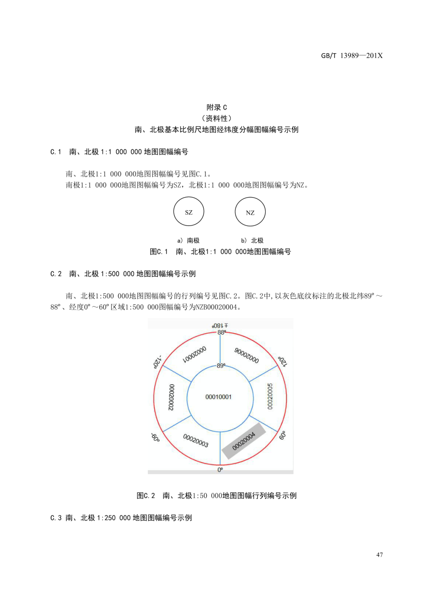

图 C.2 南、北极 1:500 000 地图图幅行列编号示例

#### C.3 南、北极 1:250 000 地图幅编号示例

南、北极1:250 000地图图幅编号的行列编号示例见图C.3。图C.3中,北极北纬89°～88°30′,东经60°～90°区域1:250 000图幅编号为NZC00030009。

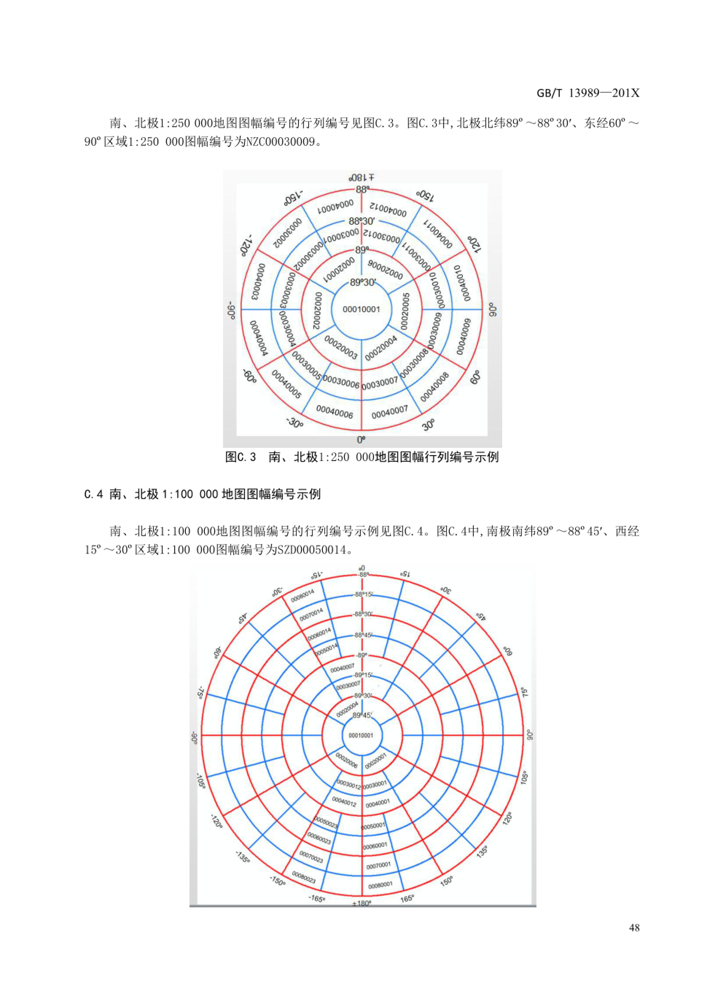

C.4 南、北极1:100 000地图图幅编号示例

南、北极1:100 000地图图幅编号的行列编号示例见图C.4。图C.4中,南极南纬89°～88°45′,西经15°～30°区域1:100 000图幅编号为SZD00050014。

图C.4 南、北极1:100 000地图图幅行列编号示例

C.5 南、北极1:50 000 地图图幅编号示例

南、北极1:50 000地图图幅编号的行列编号示例如图C.5。图C.5中，南极南纬88°7′30″～88°，经度西经60°～67°30′区域1:100 000图幅编号为SZE00160033。

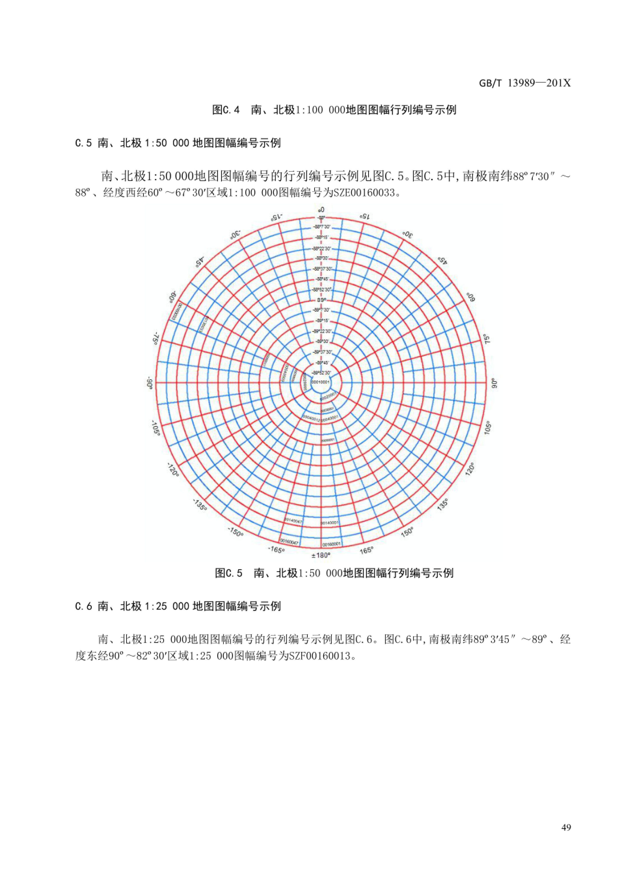

图C.5 南、北极1:50 000地图图幅行列编号示例

C.6 南、北极1:25 000 地图图幅编号示例

南、北极1:25 000地图图幅编号的行列编号示例如图C.6。图C.6中，南极南纬89°3′45″～89°，经度东经90°～82°30′区域1:25 000图幅编号为SZF00160013。

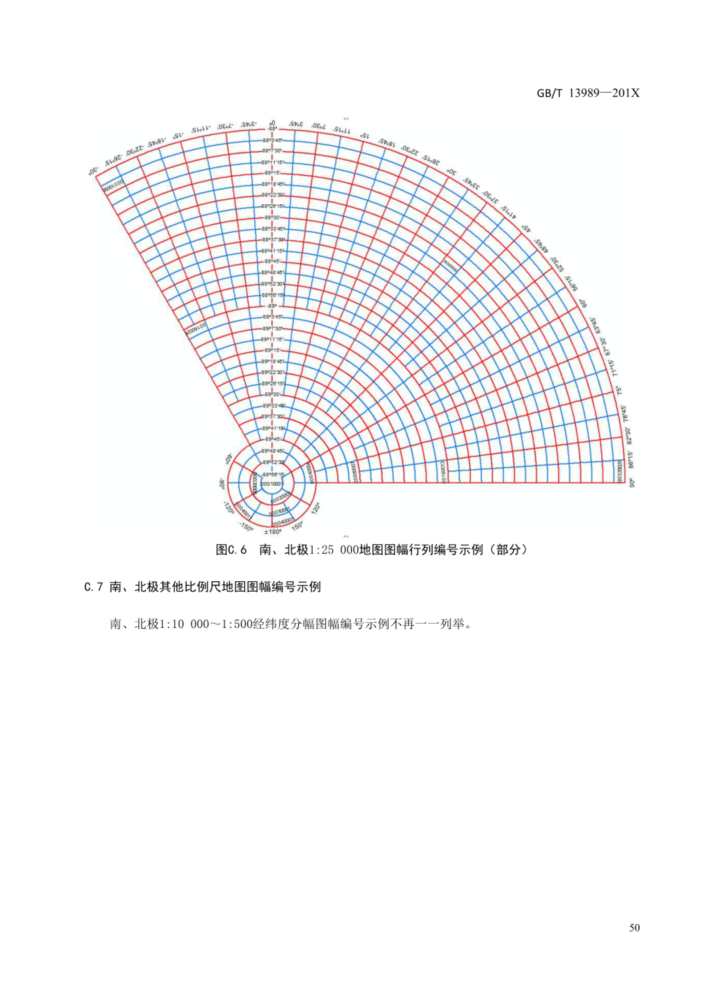

图C.6 南、北极:1:25 000地图幅行列编号示例(部分)

C.7 南、北极其他比例尺地图幅编号示例

南、北极1:10 000~1:500经纬度分幅图幅编号示例不再一一列举。

附录D  
（资料性）  
南、北极 1:500 000~1:500 基本比例尺地图经纬度分幅图幅编号和图幅经、纬度计算  

D.1 已知图幅内某点的经、纬度计算其编号  

D.1.1 计算公式  

已知南、北极图幅内某点的经、纬度，计算其所在1:500 000~1:500地图图幅编号见式D.1、D.2。  
$$ a = \left(90° - [\phi] - \Delta \phi \right) \times \Delta \phi / \Delta \phi \quad \cdots \cdots \cdots \cdots \cdots \cdots \cdots \cdots \cdots \cdots \cdots \cdots \cdots \cdots \cdots (D.1) $$  
$$ b = \left(180 + \lambda \right) \div \Delta \lambda \quad \pm EW \quad \cdots \cdots \cdots \cdots \cdots \cdots \cdots \cdots \cdots \cdots \cdots \cdots \cdots \cdots \cdots (D.2) $$  

式中：  
\[ \cdot \] — 表示商取整，向下取整；  
\| \cdot \| — 表示取绝对值；  
a — 南、北极地图图幅的行号数字码；  
b — 南、北极地图图幅的列号数字码；  
$\lambda$ — 南、北极图幅内某点的经度或南极图幅东北图廓点、北极图幅西南图廓点的经度；  
$\phi$ — 南、北极图幅内某点的纬度或南极图幅东北图廓点、北极图幅西南图廓点的纬度；  
$\Delta \phi$ — 所求比例尺地图分幅纬度间隔（见表3）；  
$\Delta \lambda$ — 所求比例尺地图分幅的纬度间隔（见表3）；  
EW — 经度为180°时取，其值取1。  

注1：以极地为中心的图幅间隔，其图幅间隔点是指图幅与180°经线的交点。  

D.1.2 计算示例  

以经度为114°33′45″，纬度为89°22′30″的某点为例，其所在1:500 000~1:500地图图幅编号计算示例如下。  

示例1：  
1:500 000地图的编号计算  
$\phi = 89°22′30″，\lambda = 114°33′45″，\Delta \phi = 1°，\Delta \lambda = 360°$  
按照公式D.1和D.2计算得出a=1，b=1  
因此，1:500 000地图图幅编号为NZ00010001.  

示例2：  
1:250 000地图的编号计算  
$\phi = 89°22′30″，\lambda = 114°33′45″，\Delta \phi = 30′，\Delta \lambda = 60°$  
按照公式D.1和D.2计算得出a=2，b=5  
因此，1:250 000地图图幅编号为NZC00020005.  

示例3：  
1:100 000地图的编号计算  
$\phi = 89°22′30″，\lambda = 114°33′45″，\Delta \phi = 15′，\Delta \lambda = 30°$  
按照公式D.1和D.2计算得出a=3，b=10  
因此，1:100 000地图图幅编号为NZD00030010.  

示例4：

1:50 000地图的幅号计算

$$\Phi = 89^\circ22'30'' , \lambda = 114^\circ33'45'' , \Delta \Phi = 7'30'' , \Delta \lambda = 15'$$

按照公式D.1和D.2计算得a=6，b=20

因此，1:50 000地图的图号为NZ0060020。

示例5:

1:50 000地图的幅号计算

$$\Phi = 89^\circ22'30'' , \lambda = 114^\circ33'45'' , \Delta \Phi = 3'45'' , \Delta \lambda = 7'30''$$

按照公式D.1和D.2计算得a=11，b=40

因此，1:50 000地图的图号为NZF0011040。

示例6:

1:10 000地图的幅号计算

$$\Phi = 89^\circ22'30'' , \lambda = 114^\circ33'45'' , \Delta \Phi = 1'52.5'' , \Delta \lambda = 3'45''$$

按照公式D.1和D.2计算得a=21，b=79

因此，1:10 000地图的图号为NZG00210079。

示例7:

1:5 000地图的幅号计算

$$\Phi = 89^\circ22'30'' , \lambda = 114^\circ33'45'' , \Delta \Phi = 56.25'' , \Delta \lambda = 1^\circ52'30''$$

按照公式D.1和D.2计算得a=41，b=158

因此，1:5 000地图的图号为NZH00410158。

示例8:

1:2 000地图的幅号计算

$$\Phi = 89^\circ22'30'' , \lambda = 114^\circ33'45'' , \Delta \Phi = 28.125'' , \Delta \lambda = 56'15''$$

按照公式D.1和D.2计算得a=81，b=315

因此，1:2 000地图的图号为NZJ00810315。

示例9:

1:1 000地图的幅号计算

$$\Phi = 89^\circ22'30'' , \lambda = 114^\circ33'45'' , \Delta \Phi = 14.0625'' , \Delta \lambda = 28'7.5''$$

按照公式D.1和D.2计算得a=161，b=629

因此，1:1 000地图的图号为NZJ01610629。

示例10:

1:500地图的幅号计算

$$\Phi = 89^\circ22'30'' , \lambda = 114^\circ33'45'' , \Delta \Phi = 7.03125'' , \Delta \lambda = 14'3.75''$$

按照公式D.1和D.2计算得a=321，b=1257

因此，1:500地图的图号为NZK03211257。

### D.2 已知南、北极图幅编号计算该图幅西南图廓点的经、纬度

#### D.2.1 计算公式

已知南、北极基本比例尺地图图幅编号，按式D.3、D.4计算其所在1:500 000~1:500地图西南图廓点的经、纬度坐标。

$$
\lambda = -(180^\circ - (b - 1) \times \Delta \lambda ) \quad \text{.................. (D.3)}
$$

$$
\Phi = (90^\circ - a \times \Delta \Phi ) \times SN \quad \text{.................. (D.4)}
$$

[ ]—表示高程数据，向下取整。
λ—图幅的经差。北极地区图幅为西南图廓点，南极地区图幅为东北图廓点；
Φ—图幅的纬差。北极地区图幅为西南图廓点，南极地区图幅为东北图廓点；
a—图幅编号的分幅度；
b—南、北极地区图幅的列号数字码；
λ—所求比例尺地图幅西图廓经差（见表3）；
Φ—所求比例尺地图幅的纬差（见表3）。
SN—南北极系数。北极时取值为1，南极时取值为-1，即南极的纬度坐标取负值。
注1：以极地中心图幅图廓侧，其图幅图廓点是指图幅180°经线的交点。

D.2.2 计算示例

以下分别给出了已知南、北极不同比例尺图幅编号，计算其图幅西南图廓点经、纬度的示例。

示例1：

已知图幅编号为NZB00020004，求其西南图廓点的经、纬度。
a=2，b=0，d=e，λ=60°，SN=1
注：由a=2，在表3可知:1:500 000图幅的行数合计为2时对应的经差λ=60°。
按公式D.3和D.3计算得出：
$$λ = (180° - (4 - 1) × 60°) × 1$$
$$= 0°$$

$$Φ = (90° - 2 × 1°) × 1$$
$$= 88°$$

因此，该1:500 000图幅西南图廓点的经、纬度分别为0°，88°。

示例2：

已知图幅编号为NZC00040006，求其西南图廓点的经、纬度。
a=4，b=6，d=e，λ=30°，SN=1
注：由a=4，在表3可知:1:250 000图幅的行数合计为4时对应的经差λ=30°。
按公式D.3和D.3计算得出：
$$λ = (180° - (6 - 1) × 30°) × 1$$
$$= 0°$$

$$Φ = (90° - 4 × 30′) × 1$$
$$= 88°$$

因此，该1:250 000图幅西南图廓点的经、纬度分别为0°，88°。

示例3：

已知图幅编号为ZSD00050014，求其西南图廓点的经、纬度。
a=5，b=14，d=e，λ=15°，SN=-1
注：由a=5，在表3可知:1:100 000图幅的行数合计为5时对应的经差λ=15°
按公式D.3和D.3计算得出：
$$λ = (180° - (14 - 1) × 15°) × (-1)$$
$$= -15°$$

$$Φ = (90° - 5 × 15′) × (-1)$$
$$= -88° 45′$$

因此，该1:100 000图幅西南图廓点的经、纬度分别为-15°，-88° 45′。

示例4：

已知图幅编号为ZE06106033，求其西南图廓点的经、纬度。

$$ a = 16, \, b = 33, \, \Delta \phi = 7' \, 30'', \, \Delta \lambda = 7' \, 30'', \, SN = 1 $$

注：$H_a = 16$，在表3可知1: 50 000图幅的行数合计为16时对应的经差 $\Delta \lambda = 7' \, 30''$。

按照公式D.3和D.3计算出：

$$ \lambda = (180^\circ - (33 - 1) \times 7' \, 30'') \times (-1) = -60^\circ $$

$$ \phi = (90^\circ - 16 \times 7' \, 30'') \times (-1) = -88^\circ $$

因此，该1: 50 000图幅西南图廓点的经、纬度分别为$-60^\circ$、$-88^\circ$。

示例5:

已知图幅编号为ZF00160013，求其西南图廓点的经、纬度。

$$ a = 16, \, b = 13, \, \Delta \phi = 3' \, 45'', \, \Delta \lambda = 7' \, 30'', \, SN = 1 $$

注：$H_a = 16$，在表3可知1: 25 000图幅的行数合计为16时对应的经差 $\Delta \lambda = 7' \, 30''$。

按照公式D.3和D.3计算出：

$$ \lambda = (180^\circ - (13 - 1) \times 7' \, 30'') \times (-1) = -90^\circ $$

$$ \phi = (90^\circ - 16 \times 3' \, 45'') \times (-1) = -89^\circ $$

因此，该1: 25 000图幅西南图廓点的经、纬度分别为$90^\circ$、$-89^\circ$。

示例6:

已知图幅编号为NZG00320013，求其西南图廓点的经、纬度。

$$ a = 32, \, b = 13, \, \Delta \phi = 1' \, 52.5'', \, \Delta \lambda = 3' \, 45'', \, SN = 1 $$

注：$H_a = 32$，在表3可知1: 10 000图幅的行数合计为32时对应的经差 $\Delta \lambda = 3' \, 45''$。

按照公式D.3和D.3计算出：

$$ \lambda = (180^\circ - (13 - 1) \times 3' \, 45'') \times 1 = -135^\circ $$

$$ \phi = (90^\circ - 32 \times 1' \, 52.5'') \times 1 = 89^\circ $$

因此，该1: 10 000图幅西南图廓点的经、纬度分别为$-135^\circ$、$89^\circ$。

示例7:

已知图幅编号为ZH00640090，求其西南图廓点的经、纬度。

$$ a = 64, \, b = 90, \, \Delta \phi = 56.25'', \, \Delta \lambda = 1' \, 52' \, 30'', \, SN = 1 $$

注：$H_a = 64$，在表3可知1: 5 000图幅的行数合计为64时对应的经差 $\Delta \lambda = 1' \, 52' \, 30''$。

按照公式D.3和D.3计算出：

$$ \lambda = (180^\circ - (90 - 1) \times 1' \, 52' \, 30'') \times (-1) = -137^\circ \, 30'' $$

$$ \phi = (90^\circ - 64 \times 56.25'') \times (-1) = -89^\circ $$

因此，该1: 5 000图幅南南图廓点的经、纬度分别为$137^\circ \, 30''$、$-89^\circ$。

示例8:

已知图幅编号为ZN01050024，求其西南图廓点的经、纬度。

$$ a = 15, \, b = 24, \, \Delta \phi = 28.125'', \, \Delta \lambda = 7' \, 30'', \, SN = 1 $$

注：$H_a = 64$，在表3可知1: 2 000图幅的行数合计为15时对应的经差 $\Delta \lambda = 7' \, 30''$。

按照公式D.3和D.3计算得出：

$$
\lambda = (180^\circ - (24^\prime 1^\prime \prime \times 7^\circ 30^\prime )) \times 1
$$

$$
= 7^\circ 30^\prime
$$

$$
\phi = (90^\circ - 152^\prime 58.125^\prime \prime ) \times 1
$$

$$
= 89^\circ 52^\prime 58.125^\prime \prime
$$

因此，该1:2000图幅西南图廓点的经、纬度分别为7°30′、89°52′58.125″。

示例9:
已知图幅编号为SZJ0064019Z，求其西南图廓点的经、纬度。
$$
a = 64, b = 192, \Delta \phi = 14.0625^\prime \prime, \Delta \lambda = 1^\prime 52^\prime 30^\prime \prime, SN = 1
$$

注：由a = 64，在表3可知1:1000图幅南行数含计为64时对应的经差为 $\Delta \lambda = 1^\prime 52^\prime 30^\prime \prime$。

按照公式D.3和D.3计算得出：

$$
\lambda = (180^\circ - (192 - 1) \times 1^\prime 52^\prime 30^\prime \prime ) \times (-1)
$$

$$
= 178^\circ 7^\prime 30^\prime \prime
$$

$$
\phi = (90^\circ - 64 \times 14.0625^\prime \prime ) \times (-1)
$$

$$
= 89^\circ 45^\prime
$$

因此，该1:1000图幅西南图廓点的经、纬度分别为178°7′30″、89°45′。

示例10:
已知图幅编号为ZNX05121536，求其西南图廓点的经、纬度。
$$
a = 512, b = 1536, \Delta \phi = 7.03125^\prime \prime, \Delta \lambda = 14^\prime 3.75^\prime \prime, SN = 1
$$

注：由a = 512，在表3可知1:500图幅南行数含计为512时对应的经差为 $\Delta \lambda = 14^\prime 3.75^\prime \prime$。

按照公式D.3和D.3计算得出：

$$
\lambda = (180^\circ - (1536 - 1) \times 14^\prime 3.75^\prime \prime )
$$

$$
= 179^\circ 45^\prime 56.25^\prime \prime
$$

$$
\phi = (90^\circ - 512 \times 7.03125^\prime \prime ) \times 1
$$

$$
= 89^\circ
$$

因此，该1:500图幅西南图廓点的经、纬度分别为179°45′56.25″、89°。

# 目 次

前言 ........................................................................................................................................................................ III

1 范围 ........................................................................................................................................................................... 1

2 规范性引用文件 ................................................................................................................................................. 1

3 术语和定义 ......................................................................................................................................................... 1

4 基本比例尺地图分幅（南、北极除外） ........................................................................................... 1

  4.1 1:1 000 000 基本比例尺地图分幅 ............................................................................................. 1
  
  4.2 1:500 000～1:15 000 基本比例尺地图分幅 ......................................................................... 4
  
  4.3 1:2 000, 1:1 000, 1:500 基本比例尺地图分幅 ..................................................................... 6

5 基本比例尺地图图幅编号（南、北极除外） ............................................................................... 6

  5.1 1:1 000 000 基本比例尺地图图幅编号 .................................................................................. 6
  
  5.2 1:500 000～1:500 基本比例尺地图经纬度分幅图幅编号 ........................................... 6
  
  5.3 1:2 000, 1:1 000, 1:500 基本比例尺地图矩形分幅图幅编号 ................................. 8
  
  5.4 1:1 000 000～1:500 基本比例尺地图（南、北极除外）图幅编号和图幅经、纬度计算 ... 9

6 南、北极基本比例尺地图分幅 ........................................................................................................... 9

  6.1 1:1 000 000 基本比例尺地图分幅 ............................................................................................. 9
  
  6.2 1:500 000～1:5 000 基本比例尺地图经纬度分幅 .......................................................... 9
  
  6.3 1:2 000, 1:1 000, 1:500 基本比例尺地图分幅 ................................................................... 11

7 南、北极基本比例尺地图图幅编号 ................................................................................................. 11

  7.1 1:1 000 000 基本比例尺地图图幅编号 ................................................................................. 11
  
  7.2 1:500 000～1:500 基本比例尺地图经纬度分幅图幅编号 ......................................... 12
  
  7.3 1:1 000 000～1:500 基本比例尺地图经纬度分幅图幅编号示例 ......................... 12
  
  7.4 1:2 000, 1:1 000, 1:500 基本比例尺地图矩形分幅图幅编号 ................................. 12
  
  7.5 1:500 000～1:500 基本比例尺地图经纬度分幅图幅编号和图幅经、纬度计算 ... 12

附录 A（资料性附录） 1:500 000～1:500 基本比例尺地图（南、北极除外）经纬度分幅图幅编号示例 ... 13

  A.1 1:500 000 基本比例尺地图图幅编号示例 ......................................................................... 13
  
  A.2 1:250 000 基本比例尺地图图幅编号示例 ......................................................................... 13
  
  A.3 1:100 000, 1:50 000 地图图幅编号示例 ................................................................................. 14
  
  A.4 1:25 000, 1:10 000, 1:5 000 基本比例尺地图图幅编号示例 ......................................... 15
  
  A.5 1:2 000, 1:1 000, 1:500 基本比例尺地图经纬度分幅图幅编号示例 ..................... 17

附录 B（资料性附录） 基本比例尺地图（南、北极除外）经纬度分幅图幅编号、纬度计算实例 ... 21

  B.1 已知图幅中央点的经、纬度计算实例 .................................................................................. 21
  
  B.2 已知图幅号计算该图幅四角点的经、纬度 ......................................................................... 42
  
  B.3 同一比例 1:1 000 地图图幅两个同比例尺地图图的行、列关系换算 .................. 45

附录 C（资料性附录） 南、北极基本比例尺地图经纬度分幅图幅编号示例 ................................. 47

  C.1 南、北极 1:1 000 000 地图图幅编号 ....................................................................................... 47
  
  C.2 南、北极 1:500 000 地图图幅编号示例 ............................................................................... 47
  
  C.3 南、北极 1:250 000 地图图幅编号示例 ............................................................................... 47
  
  C.4 南、北极 1:100 000 地图图幅编号示例 ............................................................................... 48
  
  C.5 南、北极 1:50 000 地图图幅编号示例 ................................................................................. 49
  
  C.6 南、北极 1:25 000 地图图幅编号示例 ................................................................................. 49

C.7 南、北极其他比例尺地图图幅编号示例 ....................................................... 50

附录D（资料性） 南、北极1:500 000～1:500 基本比例尺地图经纬度分幅图幅编号和图幅经、纬度计算 .......................................................... 51
D.1 已知图幅内某点的经、纬度计算其编号 ..................................................... 51
D.2 已知编号，北极图幅编号计算该图幅西南图廓点的经、纬度 ....................... 52

GB/T 13989—202X

# 全球基本比例尺地图分幅和编号

## 1 范围

本文件规定了全球基本比例尺地图的分幅和编号，并给出了全球基本比例尺地图图幅编号的示例以及各比例尺地图图幅编号和图幅经、纬度计算应用的公式及其示例。

本文件适用于全球1:1 000 000～1:500基本比例尺地图的分幅和编号。

## 2 规范性引用文件

本文件无规范性引用文件。

## 3 术语和定义

下列术语和定义适用于本文件。

### 3.1 分幅 subdivision

按照一定的规则分割地图幅的过程。

### 3.2 图幅编号 map sheets number

按照一定的规则对经过分幅的地图进行代码编制的过程或结果。

### 3.3 南、北极 north and south poles

南极极点至南纬88°和北极极点至北纬88°的区域。

## 4 基本比例尺地图分幅（南、北极除外）

### 4.1 1:1 000 000 基本比例尺地图分幅

1:1 000 000基本比例尺地图的分幅与国际1:1 000 000地图分幅保持一致。

从赤道起，每纬差4°为一行，至南、北纬88°各分为22行；从180°经线起算，自西向东经度0°～60°之间每经差6°为一列，纬度60°～76°之间每经差12°为一列，纬度76°～88°之间每经差24°为一列，全球分为60列、30列、15列，由经线和纬线所围成的每一个梯形分幅（见图1、图2）为一幅1:1 000 000地形图。

北半球、南半球1:1 000 000基本比例尺地图的分幅示例分别见图1、图2。

GB/T 13989—201X

图 1 北半球 1:1 000 000 基本比例尺地图分幅编号

图2 南半球1:1 000 000基本比例尺地图分幅编号

我国1:1 000 000基本比例尺地图分幅情况见图3。

注：在我国范围内没有纬度60°以上的需要绘制的图幅。

GB/T 13989—201X

图 3  我国 1:1 000 000 地图分幅和编号

### 4.2 1:500 000～1:5 000 基本比例尺地图分幅

1:500 000～1:5 000基本比例尺地图均以1:1 000 000基本比例尺地图为基础，按规定的经差和纬差划分图幅。

每幅1:1 000 000基本比例尺地图均分为2行2列，其幅1:500 000基本比例尺地图。

每幅1:1 000 000基本比例尺地图均分为4行4列，共16幅1:250 000基本比例尺地图，即每幅1:500 000基本比例尺地图划分为2行2列，共4幅1:250 000基本比例尺地图。

每幅1:1 000 000基本比例尺地图均分为12行12列，共144幅1:100 000基本比例尺地图，即每幅1:250 000基本比例尺地图均分为3行3列，共9幅1:100 000基本比例尺地图。

每幅1:1 000 000基本比例尺地图均分为24行24列，共576幅1:50 000基本比例尺地图，即每幅1:100 000基本比例尺地图均分为2行2列，其4幅1:50 000基本比例尺地图。

每幅1:1 000 000基本比例尺地图均分为48行48列，共2 304幅1:25 000基本比例尺地图，即每幅1:50 000基本比例尺地图均分为2行2列，其4幅1:25 000基本比例尺地图。

每幅1:1 000 000基本比例尺地图均分为96行96列，共9 216幅1:10 000基本比例尺地图，即每幅1:25 000基本比例尺地图均分为2行2列，其4幅1:10 000基本比例尺地图。

每幅1:1 000 000基本比例尺地图均分为192行192列，共36 864幅1:5 000基本比例尺地图，即每幅1:10 000基本比例尺地图均分为2行2列，其4幅1:5 000基本比例尺地图。

1:500 000～1:5 000基本比例尺地图的分幅应符合表1的规定。

# 表1 1:1 000 000～1:500基本比例尺地图（南、北极除外）分幅

| 比例尺        | 1:1 000 000 | 1:500 000 | 1:250 000 | 1:100 000 | 1:50 000 | 1:25 000 | 1:10 000 | 1:5 000 | 1:2 000 | 1:1 000 | 1:500 |
|---------------|-------------|-----------|-----------|-----------|----------|----------|----------|---------|---------|---------|-------|
| 图幅编号      |             |           |           |           |          |          |          |         |         |         |       |
| 经线带        | 6°          | 3°        | 1°30′     | 30′       | 15′      | 7′30″    | 3′45″    | 1′52.5″ | 37.5″   | 18.75″  | 9.375″|
| 纬线带        | 12°         | 6°        | 3°        | 1°        | 30′      | 15′      | 7′30″    | 3′45″   | 1′15″   | 37.5″   | 18.75″|
| 补充带        | 24°         | 12°       | 6°        | 2°        | 1°       | 30′      | 15′      | 7′30″   |         |         |       |
| 斜条          | 4°          | 2°        | 1°        | 20′       | 10′      | 5′       | 2′30″    | 1′15″   |         |         |       |
| 行列数量      |             |           |           |           |          |          |          |         |         |         |       |
| 行数          | 1           | 2         | 4         | 12        | 24       | 48       | 96       | 192     | 576     | 1 152   | 2 304 |
| 列数          | 1           | 2         | 4         | 12        | 24       | 48       | 96       | 192     | 576     | 1 152   | 2 304 |
|               | 1           | 4         | 16        | 144       | 576      | 2 304    | 9 216    | 36 864  | 331 776 | 1 327 104 | 5 308 416 |
|               |             | (2×2)     | (4×4)     | (12×12)   | (24×24)  | (48×48)  | (96×96)  | (192×192) | (576×576) | (1 152×1 152) | (2 304×2 304) |
|               | 1           | 4         | 36        | 144       | 576      | 2 304    | 9 216    | 36 864  | 331 776 | 1 327 104 | 5 308 416 |
|               |             | (2×2)     | (6×6)     | (12×12)   | (24×24)  | (48×48)  | (96×96)  | (288×288) | (576×576) | (1 152×1 152) | (2 304×2 304) |
|               | 1           | 9         | 36        | 144       | 576      | 2 304    | 9 216    | 82 944  | 331 776 | 1 327 104 | 5 308 416 |
|               |             | (3×3)     | (6×6)     | (12×12)   | (24×24)  | (48×48)  | (96×96)  | (144×144) | (288×288) | (576×576) | (1 152×1 152) |
|               | 1           | 9         | 36        | 144       | 576      | 2 304    | 9 216    | 36 864  | 331 776 | 1 327 104 | 5 308 416 |
|               |             | (3×3)     | (6×6)     | (12×12)   | (24×24)  | (48×48)  | (96×96)  | (192×192) | (576×576) | (1 152×1 152) | (2 304×2 304) |
| 图幅数量关系  |             |           |           |           |          |          |          |         |         |         |       |
| （图幅数量=   |             |           |           |           |          |          |          |         |         |         |       |
| 行数×列数）   |             |           |           |           |          |          |          |         |         |         |       |
|               | 1           | 4         | 16        | 64        | 256      | 1 024    | 4 096    | 16 384  | 65 536  | 262 144 | 1 048 576 |
|               |             | (2×2)     | (4×4)     | (8×8)     | (16×16)  | (32×32)  | (64×64)  | (128×128) | (256×256) | (512×512) | (1 024×1 024) |
|               | 1           | 4         | 16        | 64        | 256      | 1 024    | 4 096    | 16 384  | 65 536  | 262 144 | 1 048 576 |
|               |             | (2×2)     | (4×4)     | (8×8)     | (16×16)  | (32×32)  | (64×64)  | (128×128) | (256×256) | (512×512) | (1 024×1 024) |
|               | 1           | 4         | 16        | 64        | 256      | 1 024    | 4 096    | 16 384  | 65 536  | 262 144 | 1 048 576 |
|               |             | (2×2)     | (4×4)     | (8×8)     | (16×16)  | (32×32)  | (64×64)  | (128×128) | (256×256) | (512×512) | (1 024×1 024) |
|               | 1           | 4         | 16        | 64        | 256      | 1 024    | 4 096    | 16 384  | 65 536  | 262 144 | 1 048 576 |
|               |             | (2×2)     | (4×4)     | (8×8)     | (16×16)  | (32×32)  | (64×64)  | (128×128) | (256×256) | (512×512) | (1 024×1 024) |
|               | 1           | 4         | 16        | 64        | 256      | 1 024    | 4 096    | 16 384  | 65 536  | 262 144 | 1 048 576 |
|               |             | (2×2)     | (4×4)     | (8×8)     | (16×16)  | (32×32)  | (64×64)  | (128×128) | (256×256) | (512×512) | (1 024×1 024) |
|               | 1           | 4         | 16        | 64        | 256      | 1 024    | 4 096    | 16 384  | 65 536  | 262 144 | 1 048 576 |
|               |             | (2×2)     | (4×4)     | (8×8)     | (16×16)  | (32×32)  | (64×64)  | (128×128) | (256×256) | (512×512) | (1 024×1 024) |
|               | 1           |           | 9         | 36        | 144      | 576      | 2 304    | 9 216   | 36 864  |         |       |
|               |             |           | (3×3)     | (6×6)     | (12×12)  | (24×24)  | (48×48)  | (96×96)  | (192×192) |         |       |
|               | 1           |           | 4         | 16        | 64       | 256      | 1 024    | 4 096   |         |         |       |
|               |             |           | (2×2)     | (4×4)     | (8×8)    | (16×16)  | (32×32)  | (64×64)  |         |         |       |
|               | 1           |           | 1         | 4         | 16       | 64       | 256      |         |         |         |       |
|               |             |           | (2×2)     | (4×4)     | (8×8)    | (16×16)  | (32×32)  |         |         |         |       |
|               | 1           |           | 1         | 4         | 16       | 64       |         |         |         |         |       |
|               |             |           | (2×2)     | (4×4)     | (8×8)    | (16×16)  |         |         |         |         |       |
|               | 1           |           | 1         | 4         | 16       |         |         |         |         |         |       |
|               |             |           | (2×2)     | (4×4)     | (8×8)    |         |         |         |         |         |       |
|               | 1           |           | 1         | 4         |         |         |         |         |         |         |       |
|               |             |           | (2×2)     | (4×4)     |         |         |         |         |         |         |       |
|               | 1           |           | 1         |         |         |         |         |         |         |         |       |
|               |             |           | (2×2)     |         |         |         |         |         |         |         |       |
|               | 1           |           |         |         |         |         |         |         |         |         |       |

# GB/T 13989—201X

## 4.3 1:2 000，1:1 000，1:500 基本比例尺地图分幅

### 4.3.1 经线度分幅

1:2 000、1:1 000、1:500 地形图宜以 1:1 000  地形图为基础，按规定的经差和纬差划分图幅。

每幅 1:1 000 地形图划分为 576 行 576 列，共 331 776 幅 1:2 000 地形图，即每幅 1:2 000 地形图划分为 3 行 3 列，共 9 幅 1:2 000 地形图。

每幅 1:2 000 地形图划分为 152 行 152 列，共 1 327 104 幅 1:1 000 地形图，即每幅 1:2 000 地形图划分为 2 行 2 列，共 4 幅 1:1 000 地形图。

每幅 1:1 000 地形图划分为 2 304 行 2 304 列，共 5 308 416 幅 1:500 地形图，即每幅 1:1 000 地形图划分为 2 行 2 列，共 4 幅 1:500 地形图。

1:2 000、1:1 000、1:500 地形图经纬度分幅应符合表 1 的规定。

### 4.3.2 矩形分幅

1:2 000、1:1 000、1:500 基本比例尺地图可根据需要采用 50cm×50cm 或 40cm×50cm 矩形分幅。

## 5 基本比例尺地图图幅编号（南、北极除外）

### 5.1 1:1 000 000 基本比例尺地图的图幅编号

1:1 000 000 基本比例尺地图的编号与国际 1:1 000 000 地图编号保持一致。

1:1 000 000 基本比例尺地图的图幅编号，由该图所在的南北半球代码、行号和列号组成。

a) 南北半球代码：用“N”表示北半球，用“S”表示南半球。当图幅位于北半球时，亦可省略字母“N”。

b) 行号：从赤道起算，每度纬差为 1 行，至南、北纬 88°各分为 22 行，依次用大写拉丁字母（字母为 A、B、C、……、V）表示（见图 1、图 2）。

c) 列号：从 180° 经线起算，西向东每经度 20°～60°之间每经差 6°（经度 60°～76°之间每经差 12°，经度 76°～88°之间每经差 24°）为 1 列，全球分为 60 列（30 列、15 列），依次用阿拉伯数字（数字 1、01、02、03、……、60 表示（见图 1、图 2）。

注 1：我国图幅全部位于北半球以内。我国范围内 1:1 000 000 基本比例尺地图的编号由表示北半球的字母代码 N、见图 3。

注 2：为了便于基本比例尺地图幅编号和图幅经纬、纬度的计算，西半球的度数、南半球的度数均反数表示，例如，西半球西经 60°记作 －60°，南半球南纬 40°记作 －40°。见图 1、图 2。

示例：

图幅中标注“★”位置所在的 1:1 000 000 基本比例尺地图的图幅编号（南极除外）为 150，为其图幅所在的 1:1 000 000 基本比例尺地图图幅行号（字母符号），50 为图幅所在的 1:1 000 000 基本比例尺地图图幅列号（数字符号）（见图 1），省略了用来表示北半球的字母“N”。

### 5.2 1:500 000～1:500 基本比例尺地图经纬度分幅图幅编号

#### 5.2.1 经纬度分幅图幅编号结构

1:500 000～1:500 基本比例尺地图的经纬度分幅图幅编号由南北半球代码、1:1 000 000 基本比例尺地图图幅行列号、比例尺代码和图幅行号、列号组成，见图 4。

#### 图 4 1:500 000~1:1 500 000基本比例尺地图经纬度分幅图幅编号结构

5.2.2 南、北半球代码

用“N”表示图幅位于北半球，用“S”表示图幅位于南半球。
当图幅位于北半球时，亦可省略字母“N”。

5.2.3 基本比例尺地图比例代码

1:500 000~1:1 500 000基本比例尺地图分别采用不同的字母作为其比例尺的代码（见表2）。

表 2 1:500 000~1:1 500 000地图的比例尺代码

| 比例尺      | 1:500 000 | 1:250 000 | 1:100 000 | 1:50 000 | 1:25 000 | 1:10 000 | 1:5 000 | 1:2 000 | 1:1 000 | 1:500 |
|-------------|-----------|-----------|-----------|----------|----------|----------|---------|---------|---------|-------|
| 代码        | B         | C         | D         | E        | F        | G        | H       | I       | J       | K     |

5.2.4 1:500 000~1:1 500 000基本比例尺地图图幅的行列编号

1:500 000~1:1 500 000基本比例尺地图的行列编号是将1:1 000 000地图按所有各比例尺地图的经差和纬差划分成若干行和列，横行从上到下（亦称从北到南），纵列从左到右（亦称从西到东）；按顺序分别用四位阿拉伯数字（数字码）表示；不足四位者前面补零。取行号在前，列号在后的排列形式标记。
1:500 000~1:1 500 000地图的行、列号见图5。

5.2.5 1:500 000~1:1 500 000基本比例尺地图图幅编号示例

附录给出了1:500 000~1:1 500 000基本比例尺地图（南、北极除外）经纬度分幅图幅编号示例。

图 5  1:500 000～1:500基本比例尺地图幅面行列编号（南北极除外）示例

5.3  1:2 000, 1:1 000, 1:500基本比例尺地图矩形分幅图幅编号

5.3.1  图幅西南角坐标编号法

1:2 000, 1:1 000, 1:500基本比例尺地图正方形或矩形分幅可采用图幅西南角坐标公里数作为图幅编号。编号时，X坐标公里数在前，Y坐标公里数在后；1:2 000，1:1 000基本比例尺地图矩形角点坐标公里数取至0.1km（如10.0-21.0），1:500基本比例尺地图取至0.01km（如10.40-27.75）。

5.3.2  流水编号法

带状区域或小面积测区可按测区统一顺序进行图幅编号，一般按从左到右（亦称从西到东），从上到下（亦称从北到南）用阿拉伯数字1, 2, 3, 4⋯⋯编号，示例如图6。图6中灰色区域所示图幅编号为XX-8（XX为测区代号）。